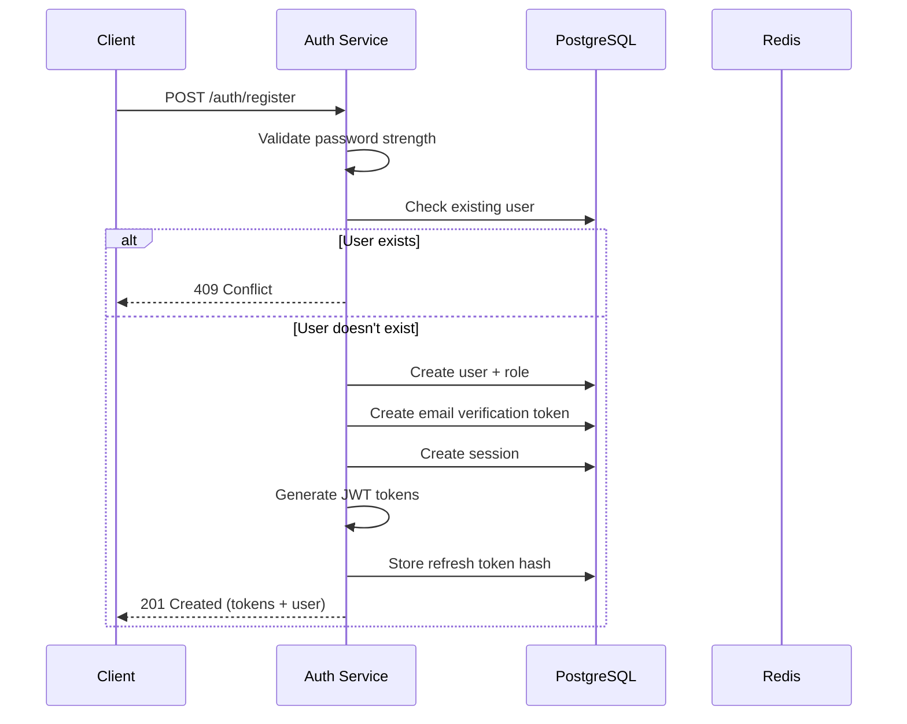
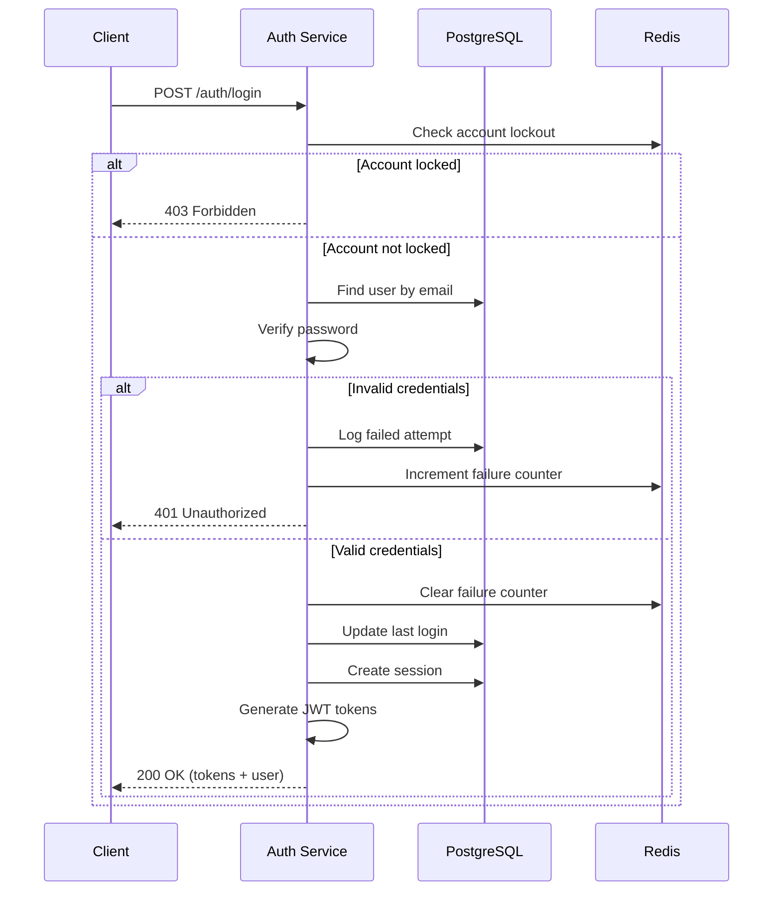
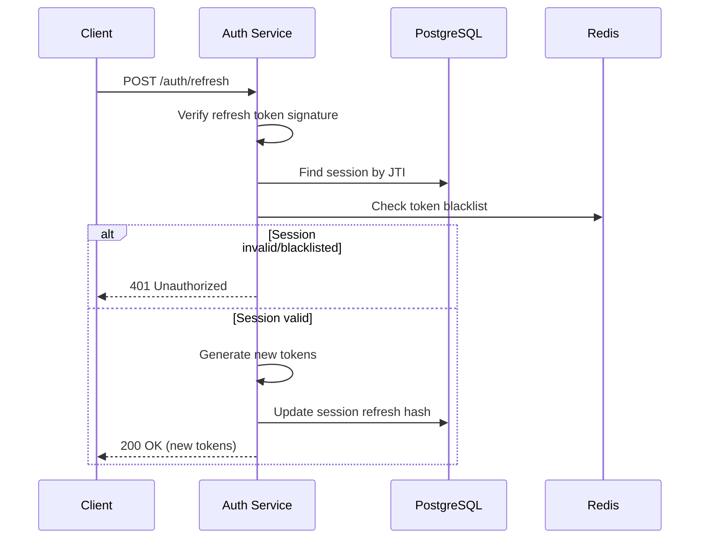
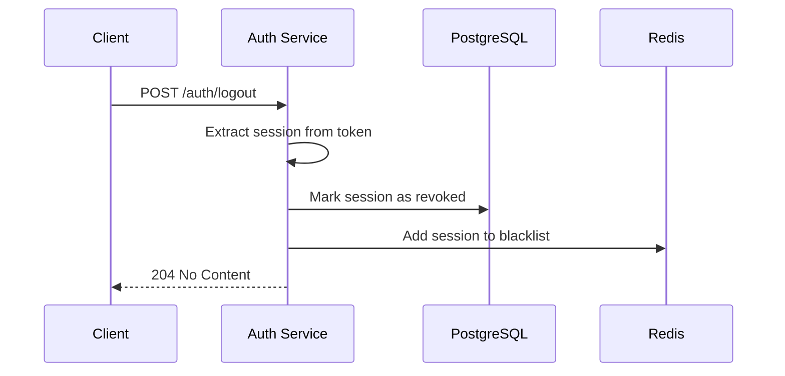
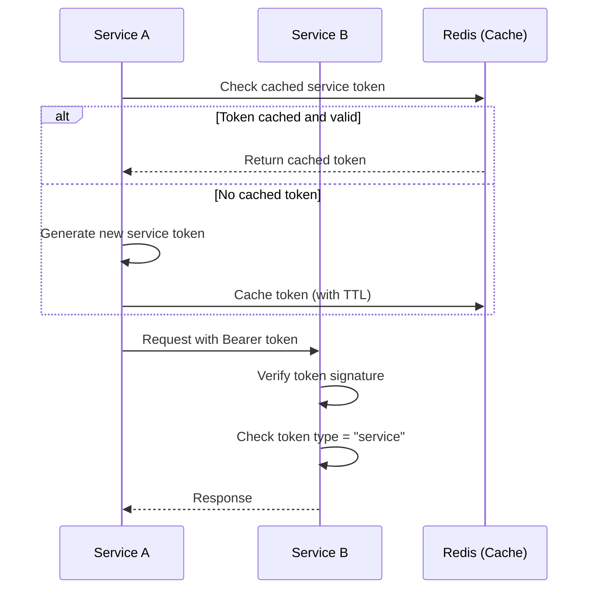

# Authentication System Documentation

This document provides comprehensive documentation for the AIVO platform's authentication system, including JWT token handling, session management, and service-to-service authentication.

## Table of Contents

1. [Overview](#overview)
2. [Architecture](#architecture)
3. [JWT Token Structure](#jwt-token-structure)
4. [Authentication Flows](#authentication-flows)
5. [API Reference](#api-reference)
6. [Security Best Practices](#security-best-practices)
7. [Configuration](#configuration)
8. [Error Handling](#error-handling)
9. [Service-to-Service Authentication](#service-to-service-authentication)
10. [Shared Library Usage](#shared-library-usage)

---

## Overview

The AIVO authentication system provides:

- **JWT-based authentication** using RS256 asymmetric encryption
- **Stateful session management** with database-backed sessions
- **Token blacklisting** via Redis for immediate invalidation
- **Multi-tenant support** with tenant-scoped authentication
- **Role-based access control** integrated with RBAC system
- **Service-to-service authentication** for microservice communication
- **Account security features** including rate limiting and lockout

## Architecture

```
┌─────────────────────────────────────────────────────────────────────┐
│                         Client Application                          │
│                    (Mobile App / Web Browser)                       │
└─────────────────────────────────────────────────────────────────────┘
                                    │
                                    ▼
┌─────────────────────────────────────────────────────────────────────┐
│                          API Gateway (Kong)                         │
│                    JWT Validation / Rate Limiting                   │
└─────────────────────────────────────────────────────────────────────┘
                                    │
                    ┌───────────────┴───────────────┐
                    ▼                               ▼
┌───────────────────────────────┐   ┌─────────────────────────────────┐
│         Auth Service          │   │        Other Services           │
│  - Login/Register             │   │  - Content Service              │
│  - Token Management           │   │  - Assessment Service           │
│  - Session Management         │   │  - Profile Service              │
│  - Password Reset             │   │  - etc.                         │
└───────────────────────────────┘   └─────────────────────────────────┘
         │              │                           │
         ▼              ▼                           ▼
┌─────────────┐  ┌─────────────┐           ┌─────────────────────┐
│  PostgreSQL │  │    Redis    │           │  Service-to-Service │
│  (Sessions) │  │ (Blacklist) │           │   Authentication    │
└─────────────┘  └─────────────┘           └─────────────────────┘
```

## JWT Token Structure

### Access Token Payload

```json
{
  "sub": "user-uuid",           // User ID
  "tenant_id": "tenant-uuid",   // Tenant ID
  "roles": ["LEARNER", "PARENT"], // User roles
  "jti": "session-uuid",        // Session ID (unique token identifier)
  "iat": 1699000000,            // Issued at timestamp
  "exp": 1699000900             // Expiration timestamp (15 min default)
}
```

### Refresh Token Payload

```json
{
  "sub": "user-uuid",
  "tenant_id": "tenant-uuid",
  "roles": ["LEARNER"],
  "jti": "session-uuid",
  "iat": 1699000000,
  "exp": 1699604800              // Expiration timestamp (7 days default)
}
```

### Service Token Payload

```json
{
  "sub": "service:content-svc",  // Service identifier
  "tenant_id": "system",         // System tenant for services
  "roles": ["SYSTEM"],           // System role for full access
  "jti": "service-token-uuid",
  "type": "service",             // Token type identifier
  "iat": 1699000000,
  "exp": 1699003600              // Expiration (1 hour default)
}
```

## Authentication Flows

### 1. User Registration



### 2. User Login



### 3. Token Refresh



### 4. Logout



## API Reference

### Authentication Endpoints

| Method | Endpoint | Description | Auth Required |
|--------|----------|-------------|---------------|
| POST | `/auth/register` | Register new user | No |
| POST | `/auth/login` | User login | No |
| POST | `/auth/refresh` | Refresh tokens | No (uses refresh token) |
| POST | `/auth/logout` | Logout current session | Yes |
| POST | `/auth/logout-all` | Logout all sessions | Yes |
| GET | `/auth/me` | Get current user | Yes |
| GET | `/auth/sessions` | List active sessions | Yes |
| DELETE | `/auth/sessions/:id` | Revoke specific session | Yes |
| POST | `/auth/verify-email` | Verify email address | No (uses token) |
| POST | `/auth/request-password-reset` | Request password reset | No |
| POST | `/auth/reset-password` | Reset password | No (uses token) |
| POST | `/auth/change-password` | Change password | Yes |
| GET | `/auth/health` | Health check | No |

### Request/Response Examples

#### Register

**Request:**
```http
POST /auth/register
Content-Type: application/json

{
  "email": "user@example.com",
  "password": "StrongP@ssw0rd!",
  "tenantId": "tenant-uuid",
  "role": "LEARNER"
}
```

**Response (201):**
```json
{
  "user": {
    "id": "user-uuid",
    "email": "user@example.com",
    "tenantId": "tenant-uuid",
    "status": "ACTIVE",
    "emailVerified": false,
    "roles": ["LEARNER"],
    "createdAt": "2024-01-15T10:30:00Z"
  },
  "accessToken": "eyJhbGciOiJSUzI1NiIs...",
  "refreshToken": "eyJhbGciOiJSUzI1NiIs...",
  "expiresIn": 900,
  "session": {
    "id": "session-uuid",
    "expiresAt": "2024-01-22T10:30:00Z"
  }
}
```

#### Login

**Request:**
```http
POST /auth/login
Content-Type: application/json
X-Device-Id: device-fingerprint-123
X-Platform: ios

{
  "email": "user@example.com",
  "password": "StrongP@ssw0rd!"
}
```

**Response (200):**
```json
{
  "user": {
    "id": "user-uuid",
    "email": "user@example.com",
    "tenantId": "tenant-uuid",
    "status": "ACTIVE",
    "emailVerified": true,
    "roles": ["LEARNER"],
    "createdAt": "2024-01-15T10:30:00Z"
  },
  "accessToken": "eyJhbGciOiJSUzI1NiIs...",
  "refreshToken": "eyJhbGciOiJSUzI1NiIs...",
  "expiresIn": 900,
  "session": {
    "id": "session-uuid",
    "expiresAt": "2024-01-22T10:30:00Z"
  }
}
```

#### Token Refresh

**Request:**
```http
POST /auth/refresh
Content-Type: application/json

{
  "refreshToken": "eyJhbGciOiJSUzI1NiIs..."
}
```

**Response (200):**
```json
{
  "accessToken": "eyJhbGciOiJSUzI1NiIs...",
  "refreshToken": "eyJhbGciOiJSUzI1NiIs...",
  "expiresIn": 900
}
```

## Security Best Practices

### Password Requirements

Passwords must meet the following criteria:
- Minimum 8 characters
- At least one uppercase letter (A-Z)
- At least one lowercase letter (a-z)
- At least one number (0-9)
- At least one special character (!@#$%^&*(),.?":{}|<>)

### Account Lockout

- **Threshold**: 5 failed login attempts
- **Lockout Duration**: 15 minutes
- **Reset**: Automatic after lockout period or successful login

### Token Security

1. **Short-lived Access Tokens**: 15 minutes by default
2. **Longer Refresh Tokens**: 7 days, stored hashed in database
3. **Token Rotation**: New refresh token issued on each refresh
4. **Token Reuse Detection**: Reused refresh tokens trigger session revocation
5. **Blacklisting**: Revoked sessions are blacklisted in Redis

### Headers for Device Tracking

Include these headers for enhanced security and session management:

```http
X-Device-Id: unique-device-fingerprint
X-Platform: ios|android|web
User-Agent: Mozilla/5.0...
```

## Configuration

### Environment Variables

| Variable | Description | Default |
|----------|-------------|---------|
| `JWT_PRIVATE_KEY` | RSA private key (PEM format) | Required |
| `JWT_PUBLIC_KEY` | RSA public key (PEM format) | Required |
| `ACCESS_TOKEN_TTL` | Access token lifetime | `15m` |
| `REFRESH_TOKEN_TTL` | Refresh token lifetime | `7d` |
| `CONSUMER_TENANT_ID` | Default tenant for consumer apps | Required |
| `REDIS_URL` | Redis connection URL | `redis://localhost:6379` |
| `DATABASE_URL` | PostgreSQL connection URL | Required |

### TTL Format

Time-to-live values use the format: `<number><unit>`
- `s` = seconds (e.g., `30s`)
- `m` = minutes (e.g., `15m`)
- `h` = hours (e.g., `1h`)
- `d` = days (e.g., `7d`)

## Error Handling

### Error Response Format

```json
{
  "error": "Human-readable error message",
  "details": [
    {
      "path": ["field"],
      "message": "Validation error detail"
    }
  ]
}
```

### Common Error Codes

| Status | Error | Description |
|--------|-------|-------------|
| 400 | Validation failed | Invalid request payload |
| 400 | Password must... | Password doesn't meet requirements |
| 401 | Invalid credentials | Wrong email or password |
| 401 | Invalid token | Token verification failed |
| 401 | Authorization required | Missing or invalid bearer token |
| 403 | Account has been disabled | User account is disabled |
| 403 | Account temporarily locked | Too many failed login attempts |
| 409 | User already exists | Email already registered |
| 404 | Session not found | Session doesn't exist or is revoked |

## Service-to-Service Authentication

### Overview

Microservices authenticate with each other using short-lived service tokens. These tokens:
- Are generated by the calling service
- Have a `type: "service"` claim
- Use the `SYSTEM` role for authorization
- Are validated by the receiving service

### Using ServiceClient

```typescript
import { ServiceClient } from '@aivo/ts-shared/auth';

const client = new ServiceClient({
  serviceName: 'content-svc',
  jwtConfig: {
    privateKey: process.env.JWT_PRIVATE_KEY!,
    publicKey: process.env.JWT_PUBLIC_KEY!,
    accessTokenTtl: '1h',
  },
  redis: redisClient, // Optional, for token caching
});

// Call another service
const response = await client.callContentService('/content/lessons/123', {
  method: 'GET',
});
```

### Service Token Flow



## Shared Library Usage

### Installation

```bash
pnpm add @aivo/ts-shared
```

### Auth Middleware (Express)

```typescript
import { createAuthMiddleware, requireRole } from '@aivo/ts-shared/auth';

const authMiddleware = createAuthMiddleware({
  jwtService: getJWTService(),
  redis: redisClient,
});

// Protect all routes
app.use(authMiddleware);

// Require specific role
app.get('/admin', requireRole(['ADMIN']), adminHandler);
```

### Auth Hook (Fastify)

```typescript
import { createFastifyAuthHook, requirePermission } from '@aivo/ts-shared/auth';

const authHook = createFastifyAuthHook({
  jwtService: getJWTService(),
  redis: redisClient,
});

// Register as preHandler
fastify.addHook('preHandler', authHook);

// Require specific permission
fastify.get('/content/:id', {
  preHandler: [authHook, requirePermission(['content:read'])],
}, contentHandler);
```

### Guards

Guards provide fine-grained access control:

```typescript
import {
  createGuard,
  allGuards,
  hasRole,
  sameTenant,
  isOwner,
} from '@aivo/ts-shared/auth';

// Combine multiple guards
const canEditContent = allGuards(
  hasRole(['TEACHER', 'ADMIN']),
  sameTenant(),
);

// Use as middleware
app.put('/content/:id', createGuard(canEditContent), editHandler);

// Check ownership
const canDeleteComment = allGuards(
  anyGuards(
    isOwner('authorId'),
    hasRole(['ADMIN']),
  ),
);
```

---

## Appendix

### Prisma Schema (Session Models)

```prisma
model Session {
  id              String   @id @default(uuid())
  userId          String
  tenantId        String
  userAgent       String?
  ipAddress       String?
  deviceId        String?
  deviceName      String?
  platform        String?
  refreshTokenHash String?
  lastActivityAt  DateTime @default(now())
  expiresAt       DateTime
  revokedAt       DateTime?
  revokeReason    String?
  createdAt       DateTime @default(now())
  updatedAt       DateTime @updatedAt

  user User @relation(fields: [userId], references: [id], onDelete: Cascade)

  @@index([userId])
  @@index([tenantId])
  @@index([expiresAt])
}
```

### Key Generation

Generate RS256 key pair for JWT signing:

```bash
# Generate private key
openssl genrsa -out private.pem 2048

# Extract public key
openssl rsa -in private.pem -pubout -out public.pem

# For environment variables (single line)
cat private.pem | tr '\n' '\\n'
```

### Rate Limiting (Kong Configuration)

```yaml
plugins:
  - name: rate-limiting
    route: auth-routes
    config:
      minute: 30
      policy: redis
      redis_host: redis
      redis_port: 6379
```
