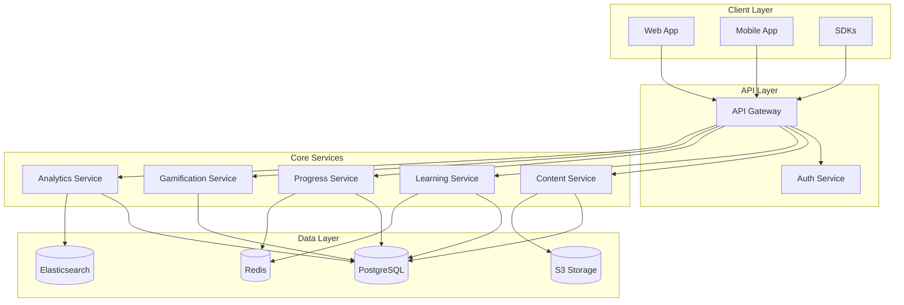
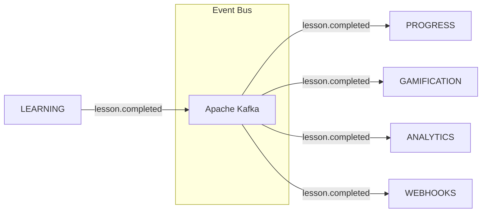
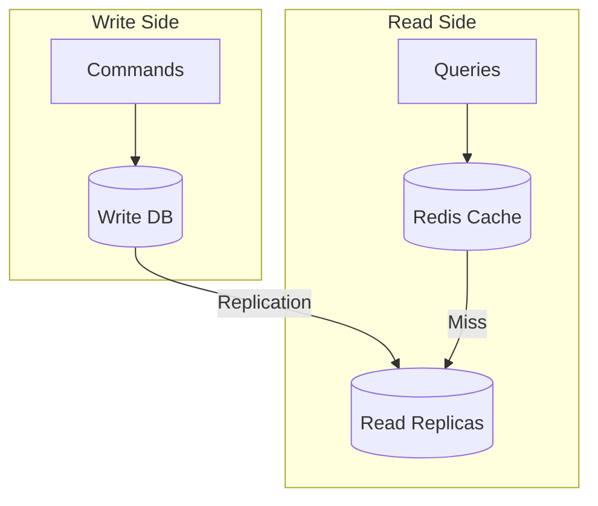
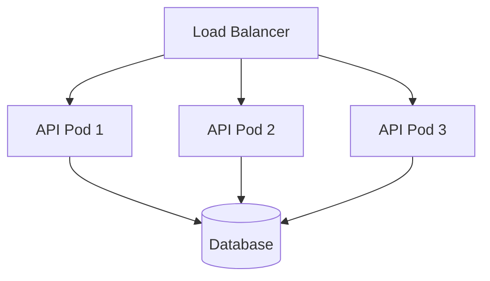
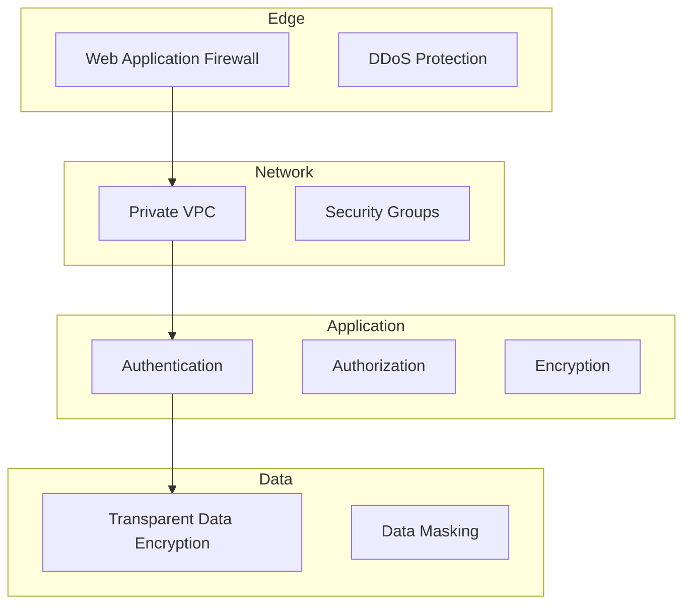

# Architecture Overview

The AIVO Platform is built on a modern, scalable microservices architecture designed for high availability, performance, and extensibility.

## Design Principles

### 1. Microservices Architecture

Each domain is implemented as an independent service:

### 2. Event-Driven Design

Services communicate asynchronously through events:

### 3. CQRS Pattern

Separate read and write models for optimal performance:

## Core Services

### API Gateway

The API Gateway handles:

- Request routing
- Rate limiting
- Authentication
- Request/response transformation
- Load balancing

**Technology:** Kong Gateway

### Auth Service

Handles authentication and authorization:

- JWT token issuance and validation
- OAuth 2.0 / OpenID Connect
- SAML 2.0 for enterprise SSO
- MFA support
- Session management

**Technology:** Node.js, PostgreSQL, Redis

### Content Service

Manages educational content:

- Lesson CRUD operations
- Content versioning
- Media processing
- Search indexing

**Technology:** Node.js, PostgreSQL, Elasticsearch, S3

### Learning Service

Handles learning sessions:

- Session management
- Answer evaluation
- Adaptive difficulty
- Real-time progress

**Technology:** Node.js, PostgreSQL, Redis

### Progress Service

Tracks learner progress:

- Skill mastery tracking
- Learning streaks
- Completion tracking
- Goal management

**Technology:** Node.js, PostgreSQL, Redis

### Gamification Service

Manages engagement features:

- XP calculations
- Achievement evaluation
- Leaderboard management
- Streak tracking

**Technology:** Node.js, PostgreSQL, Redis

### Analytics Service

Provides insights and reporting:

- Learning analytics
- Engagement metrics
- Custom reports
- Data export

**Technology:** Node.js, PostgreSQL, Elasticsearch, ClickHouse

## Data Architecture

### Primary Database (PostgreSQL)

Stores relational data:

- Users and profiles
- Lessons and courses
- Progress records
- Enrollments

**Features:**

- Logical replication for read scaling
- Point-in-time recovery
- Automatic failover

### Cache Layer (Redis)

Caches frequently accessed data:

- Session tokens
- User progress
- Leaderboards
- Rate limit counters

**Configuration:**

- Redis Cluster for high availability
- 6 shards, 3 replicas each

### Search Engine (Elasticsearch)

Powers search and analytics:

- Full-text content search
- Learning analytics aggregations
- Log analysis

### Object Storage (S3)

Stores media files:

- Video content
- Images
- Audio files
- Exports

## Scalability

### Horizontal Scaling

Each service scales independently based on load:

- Kubernetes HPA for auto-scaling
- Target: 70% CPU utilization
- Min: 3 pods, Max: 50 pods

### Database Scaling

- Read replicas for read-heavy workloads
- Connection pooling with PgBouncer
- Sharding for large tenants

### CDN Distribution

Static content served via CloudFront:

- Edge caching for global performance
- Video streaming optimization
- DDoS protection

## Security Architecture

### Defense in Depth

### Encryption

- **In Transit:** TLS 1.3
- **At Rest:** AES-256
- **Field Level:** PII encryption

### Access Control

- RBAC (Role-Based Access Control)
- Attribute-based policies
- API key scoping
- OAuth 2.0 scopes

## Monitoring & Observability

### Metrics

- **Platform:** Prometheus + Grafana
- **APM:** Datadog
- **Error Tracking:** Sentry

### Logging

- **Aggregation:** Elasticsearch + Kibana
- **Format:** Structured JSON
- **Retention:** 90 days

### Tracing

- **Platform:** Jaeger
- **Sampling:** Adaptive (1% in production)

### Alerting

- **Platform:** PagerDuty
- **Channels:** Slack, Email, SMS

## Disaster Recovery

### Backup Strategy

| Data Type      | Frequency  | Retention  |
| -------------- | ---------- | ---------- |
| Database       | Hourly     | 30 days    |
| Configurations | On change  | 1 year     |
| Media files    | Continuous | Indefinite |

### Recovery Objectives

- **RPO:** 1 hour
- **RTO:** 4 hours

### Multi-Region

- Primary: US-East-1
- Secondary: US-West-2
- Failover: Automatic with Route 53
