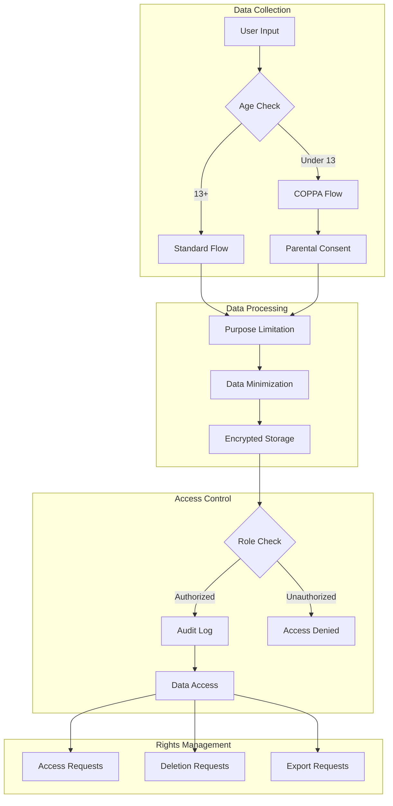

# Compliance Overview

AIVO is designed with privacy and compliance at its core. We help educational institutions meet their regulatory obligations while providing powerful learning experiences.

## Regulatory Framework

| Regulation                 | Jurisdiction   | Primary Focus             | AIVO Status |
| -------------------------- | -------------- | ------------------------- | ----------- |
| [FERPA](/compliance/ferpa) | United States  | Student education records | Compliant   |
| [COPPA](/compliance/coppa) | United States  | Children under 13         | Compliant   |
| [GDPR](/compliance/gdpr)   | EU/EEA         | Personal data protection  | Compliant   |
| CCPA/CPRA                  | California     | Consumer privacy          | Compliant   |
| PIPEDA                     | Canada         | Personal information      | Compliant   |
| UK GDPR                    | United Kingdom | Data protection           | Compliant   |

## Certifications & Attestations

### Security Certifications

| Certification    | Status | Last Audit |
| ---------------- | ------ | ---------- |
| SOC 2 Type II    | Active | Q4 2024    |
| ISO 27001        | Active | 2024       |
| ISO 27701        | Active | 2024       |
| CSA STAR Level 2 | Active | 2024       |

### Education-Specific

| Program                       | Status    |
| ----------------------------- | --------- |
| Student Privacy Pledge        | Signatory |
| 1EdTech Trusted Apps          | Certified |
| iKeepSafe COPPA Safe Harbor   | Certified |
| iKeepSafe FERPA Certification | Certified |

## Compliance Architecture



## Data Protection Principles

### Privacy by Design

AIVO implements privacy by design principles:

1. **Proactive not Reactive** - Privacy measures built in, not bolted on
2. **Privacy as Default** - Maximum privacy without user action
3. **Privacy Embedded** - Privacy integral to system design
4. **Full Functionality** - No trade-offs between privacy and features
5. **End-to-End Security** - Protection throughout data lifecycle
6. **Visibility & Transparency** - Open and verifiable practices
7. **User-Centric** - Respect for user privacy

### Data Minimization

```javascript
// AIVO collects only necessary data
const collectionPolicy = {
  required: ['email', 'name', 'role'],
  optional: ['avatar', 'timezone', 'language'],
  neverCollected: [
    'social_security_number',
    'precise_geolocation',
    'biometric_data',
    'financial_information',
  ],
};
```

### Purpose Limitation

```javascript
// Data used only for stated purposes
const purposeBindings = {
  learning_progress: ['service_delivery', 'personalization'],
  assessment_scores: ['service_delivery', 'reporting'],
  usage_analytics: ['service_improvement'], // Anonymized
  contact_info: ['service_delivery', 'support'],
};
```

## School/District Responsibilities

### Data Controller Obligations

As a school or district using AIVO, you remain the data controller and are responsible for:

| Responsibility     | Description                                      |
| ------------------ | ------------------------------------------------ |
| Legal basis        | Determine appropriate legal basis for processing |
| Privacy notices    | Inform students/parents about data practices     |
| Consent management | Obtain required consents (especially COPPA)      |
| Access requests    | Respond to parent/student data requests          |
| Staff training     | Train staff on privacy requirements              |
| Vendor management  | Review AIVO's practices annually                 |

### AIVO as Data Processor

AIVO acts as your data processor and commits to:

- Process data only on your instructions
- Implement appropriate security measures
- Assist with compliance obligations
- Return or delete data upon termination
- Support audits and inspections
- Notify of any data breaches

## Compliance Tools

### Admin Dashboard

Access compliance tools from your admin dashboard:

```javascript
// Access compliance dashboard
const compliance = await aivo.admin.getComplianceDashboard();

// Response
{
  "status": "compliant",
  "lastAudit": "2024-12-15",
  "pendingActions": [],
  "metrics": {
    "consentRate": 0.98,
    "sarResponseTime": "2.3 days",
    "dataRetentionCompliance": 1.0
  },
  "upcomingDeadlines": []
}
```

### Consent Management

```javascript
// View consent status for your organization
const consents = await aivo.admin.getConsentSummary();

// Response
{
  "totalUsers": 5000,
  "consentStatus": {
    "fullConsent": 4800,
    "partialConsent": 150,
    "pendingConsent": 50
  },
  "coppaUsers": {
    "total": 200,
    "parentalConsentObtained": 195,
    "pending": 5
  }
}
```

### Data Subject Requests

```javascript
// View and manage data requests
const requests = await aivo.admin.getDataRequests({
  status: 'pending',
  type: ['access', 'deletion', 'correction'],
});

// Process a request
await aivo.admin.processDataRequest('req_123', {
  action: 'approve',
  notes: 'Verified identity via phone',
});
```

## Audit & Reporting

### Compliance Reports

Generate compliance reports for audits and reviews:

```javascript
// Generate comprehensive compliance report
const report = await aivo.admin.generateComplianceReport({
  type: 'comprehensive',
  period: 'annual',
  regulations: ['ferpa', 'coppa', 'gdpr'],
  format: 'pdf',
});
```

### Audit Logs

```javascript
// Access detailed audit logs
const logs = await aivo.admin.getAuditLogs({
  startDate: '2024-01-01',
  endDate: '2024-12-31',
  eventTypes: ['data_access', 'consent_change', 'export'],
  exportFormat: 'csv',
});
```

## Vendor Assessment

### Security Questionnaires

AIVO provides completed security questionnaires:

- **SIG Lite** - Standardized Information Gathering
- **HECVAT** - Higher Education Community Vendor Assessment
- **VSA** - Vendor Security Alliance
- **California SSQ** - State Student Privacy Questionnaire

Request questionnaires at [security@aivo.edu](mailto:security@aivo.edu)

### Data Processing Agreement

All customers receive our Data Processing Agreement (DPA):

- GDPR Article 28 compliant
- Standard Contractual Clauses included
- FERPA-specific provisions
- COPPA compliance terms

[Download DPA Template](https://aivo.edu/legal/dpa)

## Incident Response

### Breach Notification

AIVO maintains a comprehensive incident response plan:

| Timeframe | Action                                |
| --------- | ------------------------------------- |
| Detection | Automated monitoring and alerting     |
| 4 hours   | Initial assessment and containment    |
| 24 hours  | Customer notification (if affected)   |
| 72 hours  | Regulatory notification (if required) |
| Ongoing   | Investigation and remediation         |

### Contact Information

For compliance inquiries or to report concerns:

- **Data Protection Officer**: dpo@aivo.edu
- **Security Team**: security@aivo.edu
- **Compliance Hotline**: 1-800-AIVO-DPO

## Resources

### Documentation

- [Data Processing Agreement](https://aivo.edu/legal/dpa)
- [Privacy Policy](https://aivo.edu/legal/privacy)
- [Security Whitepaper](https://aivo.edu/legal/security)
- [Subprocessor List](https://aivo.edu/legal/subprocessors)

### Training

- [FERPA Training for Staff](https://aivo.edu/training/ferpa)
- [COPPA Compliance Course](https://aivo.edu/training/coppa)
- [Data Privacy Fundamentals](https://aivo.edu/training/privacy)

### Support

- [Compliance FAQ](https://aivo.edu/support/compliance-faq)
- [Submit Compliance Question](https://aivo.edu/support/compliance)
- [Schedule Compliance Review](https://aivo.edu/sales/compliance-review)
