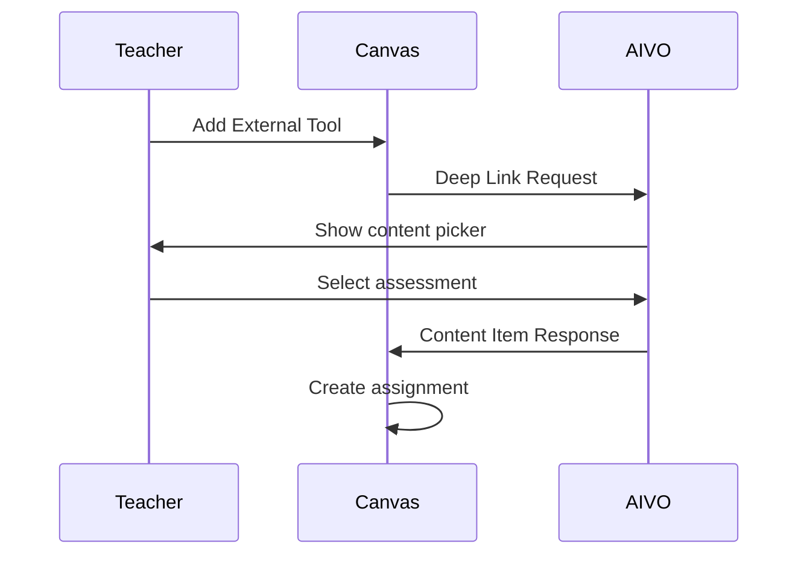
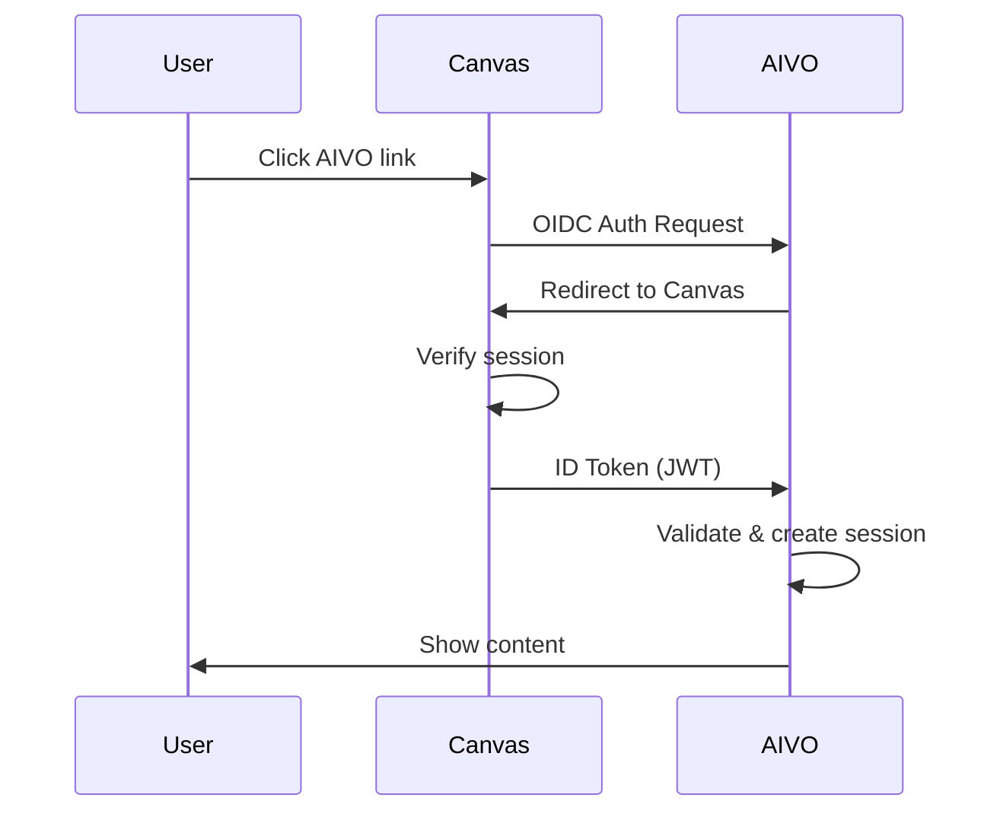

import Tabs from '@theme/Tabs';
import TabItem from '@theme/TabItem';

# Canvas LMS Integration

Integrate AIVO seamlessly with Instructure Canvas to bring interactive lessons, assessments, and progress tracking directly into your Canvas courses.

## Integration Methods

| Method           | Best For                             | Setup Complexity |
| ---------------- | ------------------------------------ | ---------------- |
| **LTI 1.3**      | Full integration with grade passback | Medium           |
| **Deep Linking** | Embedding specific content           | Low              |
| **API Sync**     | Custom data synchronization          | High             |

## LTI 1.3 Integration

### Prerequisites

- Canvas Administrator access
- AIVO Organization account
- LTI 1.3 Developer Key

### Step 1: Configure AIVO

1. Go to [AIVO Dashboard](https://dashboard.aivo.edu) → **Integrations** → **LMS**
2. Click **Add LMS** and select **Canvas**
3. Note your configuration values:

```
Platform ID: https://canvas.instructure.com
Client ID: <provided by Canvas>
Deployment ID: <provided by Canvas>
OIDC Auth URL: https://<your-canvas>/api/lti/authorize_redirect
JWKS URL: https://<your-canvas>/api/lti/security/jwks
Access Token URL: https://<your-canvas>/login/oauth2/token
```

### Step 2: Create Developer Key in Canvas

1. Go to **Admin** → **Developer Keys**
2. Click **+ Developer Key** → **LTI Key**
3. Configure the key:

```yaml
Key Name: AIVO Learning Platform
Redirect URIs:
  - https://api.aivo.edu/lti/callback

Target Link URI: https://api.aivo.edu/lti/launch

OpenID Connect Initiation URL: https://api.aivo.edu/lti/oidc

JWK Method: Public JWK URL
Public JWK URL: https://api.aivo.edu/.well-known/jwks.json

LTI Advantage Services:
  - Can create and view assignment data
  - Can view submission data
  - Can create and update submission grades
  - Can retrieve user data
  - Can lookup user accounts
```

4. Add Custom Fields:

```
aivo_org_id=$Canvas.account.id
aivo_course_id=$Canvas.course.id
aivo_user_id=$Canvas.user.id
aivo_role=$Canvas.membership.roles
```

5. Save and note the **Client ID**

### Step 3: Enable the App

1. Go to **Admin** → **Settings** → **Apps**
2. Click **+ App**
3. Select **By Client ID**
4. Enter the Client ID from Step 2
5. Click **Submit**

### Step 4: Test the Integration

1. Create a new assignment in a course
2. Select **External Tool** as submission type
3. Click **Find** and select **AIVO Learning Platform**
4. Choose a lesson to embed
5. Save the assignment

## Deep Linking (LTI Content Item)

Embed specific AIVO content directly in Canvas modules:

### Embedding a Lesson

1. In your Canvas course, go to **Modules**
2. Click **+** to add an item
3. Select **External Tool**
4. Choose **AIVO Learning Platform**
5. Browse and select content
6. Click **Add Item**

### Embedding an Assessment



## Grade Passback (AGS)

AIVO automatically syncs grades back to Canvas using Assignment and Grade Services (AGS).

### Configuration

Enable grade passback in AIVO:

```javascript
// AIVO Dashboard → Integrations → Canvas → Settings
{
  "gradePassback": {
    "enabled": true,
    "syncMode": "immediate", // or "batch"
    "gradeType": "percentage", // or "points"
    "includeComments": true
  }
}
```

### Grade Sync Events

| Event                | Canvas Action                |
| -------------------- | ---------------------------- |
| Lesson completed     | Update submission grade      |
| Assessment submitted | Create submission with grade |
| Assessment regraded  | Update existing submission   |

### Manual Sync

Force grade sync via API:

```javascript
await aivo.lti.syncGrades({
  courseId: 'crs_abc123',
  lmsId: 'canvas_12345',
  force: true,
});
```

## Roster Sync (NRPS)

Automatically sync class rosters from Canvas:

```javascript
// Enable roster sync
await aivo.lti.configureRosterSync({
  lmsId: 'canvas_12345',
  enabled: true,
  syncInterval: 'daily', // hourly, daily, weekly
  createUsers: true,
  deactivateRemoved: false,
});
```

### Sync Status

```javascript
const status = await aivo.lti.getRosterSyncStatus('canvas_12345');

console.log(`Last sync: ${status.lastSyncAt}`);
console.log(`Users synced: ${status.usersSynced}`);
console.log(`Errors: ${status.errors.length}`);
```

## Single Sign-On

Students and teachers are automatically authenticated when launching from Canvas:



### User Mapping

AIVO maps Canvas users using:

| Canvas Field  | AIVO Field    |
| ------------- | ------------- |
| `sub`         | `ltiUserId`   |
| `email`       | `email`       |
| `name`        | `displayName` |
| `given_name`  | `givenName`   |
| `family_name` | `familyName`  |
| `roles`       | `role`        |

## API Integration

For custom integrations, use the Canvas and AIVO APIs together:

### Sync Course Data

```javascript
import Aivo from '@aivo/sdk';
import { CanvasApi } from 'canvas-api';

const aivo = new Aivo({ apiKey: process.env.AIVO_API_KEY });
const canvas = new CanvasApi({
  token: process.env.CANVAS_TOKEN,
  domain: 'your-school.instructure.com',
});

// Get Canvas course
const canvasCourse = await canvas.courses.get(courseId);

// Create AIVO course linked to Canvas
const aivoCourse = await aivo.courses.create({
  title: canvasCourse.name,
  description: canvasCourse.description,
  externalId: canvasCourse.id,
  lmsType: 'canvas',
  metadata: {
    canvasId: canvasCourse.id,
    canvasCode: canvasCourse.course_code,
  },
});
```

### Webhook Integration

Listen for Canvas events:

```javascript
// Receive Canvas webhook
app.post('/webhooks/canvas', async (req, res) => {
  const event = req.body;

  switch (event.event_type) {
    case 'submission_created':
      await handleSubmission(event);
      break;
    case 'enrollment_created':
      await handleEnrollment(event);
      break;
  }

  res.status(200).send('OK');
});
```

## Troubleshooting

### Common Issues

<details>
<summary>LTI launch fails with "Invalid signature"</summary>

1. Verify the JWKS URL is accessible
2. Check that the Client ID matches
3. Ensure clock sync between servers (max 5 min drift)

</details>

<details>
<summary>Grades not syncing to Canvas</summary>

1. Verify AGS is enabled in the Developer Key
2. Check the assignment was created via LTI
3. Review the sync logs in AIVO Dashboard

</details>

<details>
<summary>Users not being created automatically</summary>

1. Enable "Create Users" in roster sync settings
2. Verify NRPS is enabled in Canvas
3. Check user email domains are allowed

</details>

### Getting Help

- [Canvas LTI Documentation](https://canvas.instructure.com/doc/api/lti.html)
- [AIVO Support](mailto:support@aivo.edu)
- [Community Discord](https://discord.gg/aivo)
