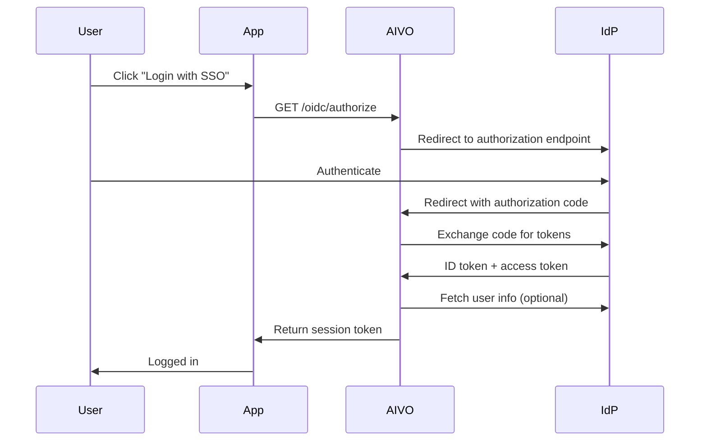

# OpenID Connect Integration

AIVO supports OpenID Connect (OIDC) for modern, token-based authentication with identity providers.

## Overview

OpenID Connect is an identity layer built on top of OAuth 2.0. It provides:

- **ID Tokens** - JWT containing user identity claims
- **UserInfo Endpoint** - Additional user information
- **Discovery** - Automatic configuration via well-known endpoint
- **Dynamic Registration** - Programmatic client registration

## Quick Setup

### 1. Register AIVO with Your IdP

Register AIVO as an OIDC client:

| Setting         | Value                                                |
| --------------- | ---------------------------------------------------- |
| Client Type     | Confidential                                         |
| Redirect URI    | `https://api.aivo.edu/oidc/{org_id}/callback`        |
| Post-Logout URI | `https://api.aivo.edu/oidc/{org_id}/logout/callback` |
| Scopes          | `openid profile email`                               |

### 2. Configure AIVO

```javascript
await aivo.admin.sso.configureOidc({
  enabled: true,

  // Provider configuration
  provider: {
    // Auto-discover from well-known endpoint
    issuer: 'https://idp.school.edu',
    // Or specify manually
    // authorizationEndpoint: 'https://idp.school.edu/authorize',
    // tokenEndpoint: 'https://idp.school.edu/token',
    // userInfoEndpoint: 'https://idp.school.edu/userinfo',
    // jwksUri: 'https://idp.school.edu/.well-known/jwks.json',
  },

  // Client credentials
  client: {
    id: 'aivo-client-id',
    secret: 'aivo-client-secret',
  },

  // Requested scopes
  scopes: ['openid', 'profile', 'email', 'groups'],

  // Claim mapping
  claimMapping: {
    email: 'email',
    name: 'name',
    firstName: 'given_name',
    lastName: 'family_name',
    picture: 'picture',
    groups: 'groups',
  },
});
```

## Provider-Specific Guides

### Auth0

```javascript
await aivo.admin.sso.configureOidc({
  provider: {
    issuer: 'https://your-tenant.auth0.com/',
  },
  client: {
    id: process.env.AUTH0_CLIENT_ID,
    secret: process.env.AUTH0_CLIENT_SECRET,
  },
  scopes: ['openid', 'profile', 'email'],
});
```

Auth0 Dashboard configuration:

1. Create Application → Regular Web Application
2. Add Callback URL: `https://api.aivo.edu/oidc/{org_id}/callback`
3. Add Logout URL: `https://api.aivo.edu/oidc/{org_id}/logout/callback`

### Okta

```javascript
await aivo.admin.sso.configureOidc({
  provider: {
    issuer: 'https://your-org.okta.com',
  },
  client: {
    id: process.env.OKTA_CLIENT_ID,
    secret: process.env.OKTA_CLIENT_SECRET,
  },
  scopes: ['openid', 'profile', 'email', 'groups'],
});
```

### Azure AD / Entra ID

```javascript
await aivo.admin.sso.configureOidc({
  provider: {
    issuer: 'https://login.microsoftonline.com/{tenant_id}/v2.0',
  },
  client: {
    id: process.env.AZURE_CLIENT_ID,
    secret: process.env.AZURE_CLIENT_SECRET,
  },
  scopes: ['openid', 'profile', 'email', 'User.Read'],
  claimMapping: {
    email: 'preferred_username',
    name: 'name',
    groups: 'groups',
  },
});
```

### Google

```javascript
await aivo.admin.sso.configureOidc({
  provider: {
    issuer: 'https://accounts.google.com',
  },
  client: {
    id: process.env.GOOGLE_CLIENT_ID,
    secret: process.env.GOOGLE_CLIENT_SECRET,
  },
  scopes: ['openid', 'profile', 'email'],
  // Restrict to specific domain
  hostedDomain: 'school.edu',
});
```

### Keycloak

```javascript
await aivo.admin.sso.configureOidc({
  provider: {
    issuer: 'https://keycloak.school.edu/realms/education',
  },
  client: {
    id: process.env.KEYCLOAK_CLIENT_ID,
    secret: process.env.KEYCLOAK_CLIENT_SECRET,
  },
  scopes: ['openid', 'profile', 'email', 'roles'],
  claimMapping: {
    groups: 'realm_access.roles',
  },
});
```

## Authentication Flow

### Authorization Code Flow



### Initiate Login

```javascript
// Get authorization URL
const authUrl = await aivo.auth.getOidcLoginUrl({
  redirectUri: 'https://app.aivo.edu/callback',
  state: 'random-state-value',
  nonce: 'random-nonce-value',
  prompt: 'login', // Force re-authentication
});

// Redirect user to authUrl
```

### Handle Callback

```javascript
// After user returns from IdP
const result = await aivo.auth.handleOidcCallback({
  code: req.query.code,
  state: req.query.state,
  expectedState: session.state,
});

// result contains:
// - user: AIVO user object
// - accessToken: AIVO access token
// - idToken: Original OIDC ID token
// - expiresAt: Token expiration
```

## Token Handling

### ID Token Validation

AIVO automatically validates ID tokens:

```javascript
await aivo.admin.sso.configureOidc({
  tokenValidation: {
    // Validate signature using JWKS
    validateSignature: true,

    // Validate standard claims
    validateIssuer: true,
    validateAudience: true,
    validateExpiration: true,
    validateNonce: true,

    // Clock skew tolerance
    clockSkewSeconds: 60,

    // Required claims
    requiredClaims: ['email', 'email_verified'],
  },
});
```

### Refresh Tokens

```javascript
await aivo.admin.sso.configureOidc({
  // Request offline access
  scopes: ['openid', 'profile', 'email', 'offline_access'],

  // Token refresh settings
  refreshTokens: {
    enabled: true,
    rotateOnRefresh: true,
    absoluteLifetime: 86400 * 7, // 7 days
  },
});
```

## User Provisioning

### Just-In-Time Provisioning

```javascript
await aivo.admin.sso.configureOidc({
  provisioning: {
    enabled: true,
    createUsers: true,
    updateOnLogin: true,

    // Attribute mapping
    attributeMapping: {
      email: 'email',
      name: 'name',
      firstName: 'given_name',
      lastName: 'family_name',
      picture: 'picture',
    },

    // Default role for new users
    defaultRole: 'student',

    // Role mapping from groups claim
    roleMapping: {
      educators: 'teacher',
      students: 'student',
      admins: 'admin',
    },
  },
});
```

### SCIM Provisioning

For enterprise deployments, combine OIDC with SCIM:

```javascript
await aivo.admin.sso.configureOidc({
  provisioning: {
    enabled: true,
    method: 'scim', // Use SCIM for provisioning
    createOnFirstLogin: false, // Only allow pre-provisioned users
  },
});
```

## Logout

### RP-Initiated Logout

```javascript
// Get logout URL
const logoutUrl = await aivo.auth.getOidcLogoutUrl({
  idTokenHint: user.idToken,
  postLogoutRedirectUri: 'https://app.aivo.edu',
  state: 'logout-state',
});

// Redirect user to logoutUrl
```

### Back-Channel Logout

```javascript
// Configure back-channel logout
await aivo.admin.sso.configureOidc({
  logout: {
    backChannelLogout: {
      enabled: true,
      uri: 'https://api.aivo.edu/oidc/{org_id}/logout/backchannel',
      sessionRequired: true,
    },
  },
});
```

## Security Configuration

### PKCE

Enable Proof Key for Code Exchange:

```javascript
await aivo.admin.sso.configureOidc({
  security: {
    usePkce: true,
    pkceMethod: 'S256', // SHA-256
  },
});
```

### State and Nonce

```javascript
await aivo.admin.sso.configureOidc({
  security: {
    requireState: true,
    requireNonce: true,
    stateLifetimeSeconds: 600,
  },
});
```

### Token Binding

```javascript
await aivo.admin.sso.configureOidc({
  security: {
    // Bind tokens to specific client
    tokenBinding: {
      enabled: true,
      method: 'dpop', // DPoP token binding
    },
  },
});
```

## Testing

### Test Configuration

```javascript
// Validate OIDC configuration
const validation = await aivo.admin.sso.validateOidcConfig();

if (!validation.valid) {
  console.log('Issues found:');
  validation.issues.forEach((issue) => {
    console.log(`  [${issue.severity}] ${issue.message}`);
  });
}

// Test discovery endpoint
const discovery = await aivo.admin.sso.testOidcDiscovery();
console.log('Authorization endpoint:', discovery.authorization_endpoint);
console.log('Token endpoint:', discovery.token_endpoint);

// Fetch JWKS
const jwks = await aivo.admin.sso.getProviderJwks();
console.log('Available signing keys:', jwks.keys.length);
```

### Debug Mode

```javascript
await aivo.admin.sso.configureOidc({
  debug: {
    enabled: true,
    logTokens: false, // Don't log actual tokens
    logClaims: true, // Log claim names (not values)
  },
});
```

## Troubleshooting

### Common Errors

| Error              | Cause                    | Solution                           |
| ------------------ | ------------------------ | ---------------------------------- |
| `invalid_client`   | Wrong client credentials | Verify client ID and secret        |
| `invalid_grant`    | Expired or used code     | Ensure code is used promptly       |
| `invalid_token`    | Token validation failed  | Check issuer, audience, expiration |
| `access_denied`    | User denied consent      | Check required scopes              |
| `discovery_failed` | Can't reach IdP          | Verify issuer URL, check network   |

### View Login Attempts

```javascript
const attempts = await aivo.admin.sso.getLoginAttempts({
  protocol: 'oidc',
  status: 'failed',
  startDate: '2024-01-01',
  limit: 100,
});

attempts.forEach((attempt) => {
  console.log(`${attempt.timestamp}: ${attempt.error}`);
  console.log(`  Provider: ${attempt.provider}`);
  console.log(`  Error details: ${attempt.errorDescription}`);
});
```

## Resources

- [OpenID Connect Core Specification](https://openid.net/specs/openid-connect-core-1_0.html)
- [OAuth 2.0 RFC 6749](https://tools.ietf.org/html/rfc6749)
- [JWT RFC 7519](https://tools.ietf.org/html/rfc7519)
- [PKCE RFC 7636](https://tools.ietf.org/html/rfc7636)
