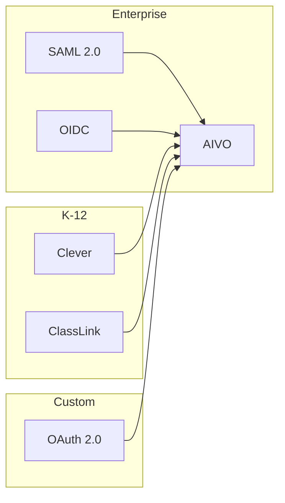
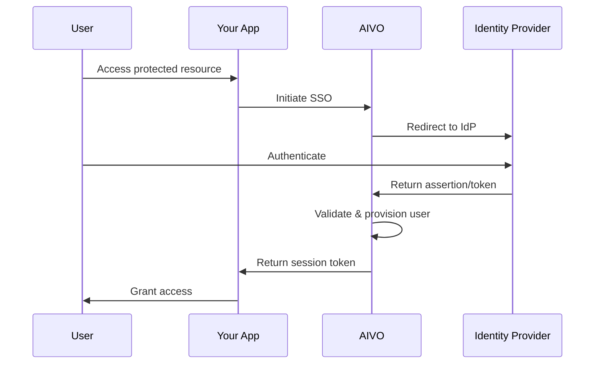

# Single Sign-On (SSO) Overview

AIVO supports multiple SSO protocols to integrate seamlessly with your existing identity infrastructure.

## Supported Protocols

| Protocol                                 | Use Case            | Features                        |
| ---------------------------------------- | ------------------- | ------------------------------- |
| [SAML 2.0](/integrations/sso/saml)       | Enterprise IdPs     | Full SSO, SLO, JIT provisioning |
| [OpenID Connect](/integrations/sso/oidc) | Modern applications | OAuth 2.0, ID tokens, UserInfo  |
| [OAuth 2.0](/integrations/sso/oauth)     | API authorization   | Delegated access, scopes        |
| [Clever](/integrations/sso/clever)       | K-12 schools        | Rostering, SSO, data sync       |
| [ClassLink](/integrations/sso/classlink) | K-12 districts      | LaunchPad, roster sync          |

## Quick Comparison



## Architecture

### Authentication Flow



## Configuration

### Enable SSO

```javascript
// Enable SSO for your organization
await aivo.admin.sso.configure({
  enabled: true,
  protocol: 'saml', // or 'oidc', 'oauth', 'clever', 'classlink'
  allowPasswordLogin: false, // Enforce SSO-only
  autoProvision: true,
  defaultRole: 'student',
});
```

### Just-In-Time Provisioning

When enabled, AIVO automatically creates user accounts on first SSO login:

```javascript
await aivo.admin.sso.configure({
  autoProvision: true,
  provisioningRules: {
    // Map IdP attributes to AIVO fields
    attributeMapping: {
      email: 'mail',
      name: 'displayName',
      firstName: 'givenName',
      lastName: 'sn',
      role: 'eduPersonAffiliation',
    },
    // Role mapping
    roleMapping: {
      student: ['student', 'learner'],
      teacher: ['faculty', 'instructor', 'teacher'],
      admin: ['staff', 'administrator'],
    },
    // Group sync
    groupSync: {
      enabled: true,
      attribute: 'memberOf',
    },
  },
});
```

## Domain Verification

Before enabling SSO, verify your domain:

```javascript
// Add domain
const domain = await aivo.admin.domains.add({
  domain: 'school.edu',
  verificationMethod: 'dns', // or 'file'
});

// Get DNS record to add
console.log(domain.verification.dnsRecord);
// { type: 'TXT', name: '_aivo-verification', value: 'aivo-verify=abc123' }

// Verify domain
const verified = await aivo.admin.domains.verify('school.edu');
```

## Session Management

### Session Configuration

```javascript
await aivo.admin.sso.configure({
  session: {
    lifetime: 28800, // 8 hours
    idleTimeout: 3600, // 1 hour
    singleSessionPerUser: false,
    rememberMe: {
      enabled: true,
      duration: 604800, // 7 days
    },
  },
});
```

### Single Logout (SLO)

```javascript
// Configure single logout
await aivo.admin.sso.configure({
  singleLogout: {
    enabled: true,
    logoutUrl: 'https://idp.school.edu/logout',
    notifyIdp: true,
  },
});

// Initiate logout
await aivo.auth.logout({
  userId: 'usr_123',
  singleLogout: true, // Also logout from IdP
});
```

## Multi-Tenancy

Support multiple identity providers for different groups:

```javascript
// Configure multiple IdPs
await aivo.admin.sso.configureMultiIdp({
  idps: [
    {
      id: 'main-district',
      name: 'District SSO',
      protocol: 'saml',
      domains: ['@district.edu'],
      primary: true,
    },
    {
      id: 'partner-school',
      name: 'Partner School',
      protocol: 'oidc',
      domains: ['@partnerschool.org'],
    },
  ],

  // IdP discovery
  discovery: {
    method: 'email_domain', // or 'manual_selection'
    fallback: 'main-district',
  },
});
```

## Security Best Practices

### Recommended Settings

```javascript
await aivo.admin.sso.configure({
  security: {
    // Require MFA from IdP
    requireMfa: true,

    // Enforce HTTPS
    httpsOnly: true,

    // Signature requirements
    signatureRequired: true,
    signatureAlgorithm: 'RSA-SHA256',

    // Encryption
    encryptAssertions: true,
    encryptionAlgorithm: 'AES-256-CBC',

    // Clock skew tolerance
    clockSkewSeconds: 300,

    // Replay protection
    replayProtection: true,
    assertionLifetimeSeconds: 300,
  },
});
```

### Access Controls

```javascript
// Restrict SSO to specific groups
await aivo.admin.sso.configure({
  accessControl: {
    allowedGroups: ['students', 'faculty', 'staff'],
    deniedGroups: ['suspended'],
    requireEmailVerification: true,
  },
});
```

## Troubleshooting

### Debug Mode

```javascript
// Enable SSO debug logging
await aivo.admin.sso.configure({
  debug: {
    enabled: true,
    logAssertions: true, // Log SAML assertions (sanitized)
    logTokens: false, // Don't log full tokens
    retentionDays: 7,
  },
});

// View SSO logs
const logs = await aivo.admin.sso.getLogs({
  startDate: '2024-01-01',
  endDate: '2024-01-31',
  status: 'failed',
});
```

### Common Issues

| Issue             | Cause                   | Solution                     |
| ----------------- | ----------------------- | ---------------------------- |
| Invalid signature | Certificate mismatch    | Update IdP certificate       |
| Clock skew        | Server time difference  | Sync NTP, increase tolerance |
| User not found    | No JIT provisioning     | Enable auto-provisioning     |
| Attribute missing | Wrong attribute mapping | Check IdP attribute release  |

## Next Steps

- [SAML 2.0 Configuration](/integrations/sso/saml)
- [OpenID Connect Setup](/integrations/sso/oidc)
- [OAuth 2.0 Integration](/integrations/sso/oauth)
- [Clever SSO](/integrations/sso/clever)
- [ClassLink LaunchPad](/integrations/sso/classlink)
