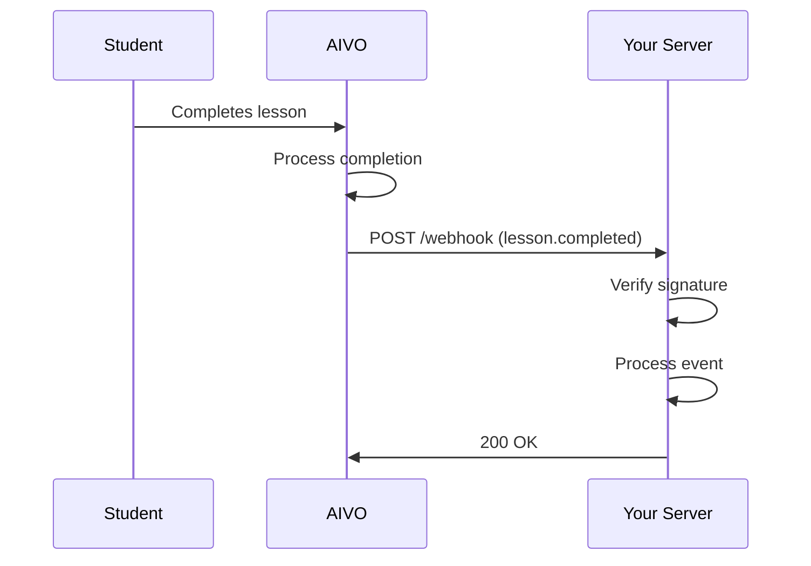

import Tabs from '@theme/Tabs';
import TabItem from '@theme/TabItem';

# Webhooks

Webhooks enable real-time notifications when events occur in the AIVO platform. Instead of polling the API, your server receives HTTP POST requests when students complete lessons, earn achievements, and more.

## How Webhooks Work



## Available Events

| Event                  | Description                          |
| ---------------------- | ------------------------------------ |
| `lesson.started`       | Student started a lesson             |
| `lesson.completed`     | Student completed a lesson           |
| `assessment.submitted` | Student submitted an assessment      |
| `assessment.graded`    | Assessment was graded                |
| `achievement.earned`   | Student earned an achievement        |
| `user.created`         | New user registered                  |
| `user.updated`         | User profile updated                 |
| `enrollment.created`   | Student enrolled in a course         |
| `enrollment.completed` | Student completed a course           |
| `course.completed`     | Student completed all course lessons |

## Webhook Payload

All webhook payloads follow this structure:

```json
{
  "id": "evt_abc123",
  "type": "lesson.completed",
  "created": "2024-01-15T10:30:00Z",
  "data": {
    "lessonId": "les_xyz789",
    "userId": "usr_def456",
    "score": 95,
    "duration": 1800,
    "xpEarned": 100
  },
  "metadata": {
    "apiVersion": "2024-01-01",
    "webhookId": "wh_abc123"
  }
}
```

## Creating a Webhook

### Via API

```javascript
const webhook = await aivo.webhooks.create({
  url: 'https://your-server.com/webhooks/aivo',
  events: ['lesson.completed', 'achievement.earned'],
  description: 'Production webhook',
});

console.log(`Webhook created: ${webhook.id}`);
console.log(`Secret: ${webhook.secret}`); // Save this securely!
```

### Via Dashboard

1. Go to [Developer Dashboard](https://developers.aivo.edu/dashboard/webhooks)
2. Click **Create Webhook**
3. Enter your endpoint URL
4. Select events to subscribe to
5. Copy and save the signing secret

## Receiving Webhooks

<Tabs groupId="language">
<TabItem value="javascript" label="Node.js (Express)">

```javascript
import express from 'express';
import { verifyWebhookSignature } from '@aivo/sdk';

const app = express();

app.post('/webhooks/aivo', express.raw({ type: 'application/json' }), (req, res) => {
  const signature = req.headers['x-aivo-signature'];
  const timestamp = req.headers['x-aivo-timestamp'];

  // Verify signature
  const isValid = verifyWebhookSignature(
    req.body,
    signature,
    process.env.AIVO_WEBHOOK_SECRET,
    timestamp
  );

  if (!isValid) {
    return res.status(401).send('Invalid signature');
  }

  const event = JSON.parse(req.body);

  // Handle the event
  switch (event.type) {
    case 'lesson.completed':
      handleLessonCompleted(event.data);
      break;
    case 'achievement.earned':
      handleAchievementEarned(event.data);
      break;
    default:
      console.log(`Unhandled event type: ${event.type}`);
  }

  res.status(200).json({ received: true });
});

function handleLessonCompleted(data) {
  console.log(`User ${data.userId} completed lesson ${data.lessonId}`);
  console.log(`Score: ${data.score}, XP earned: ${data.xpEarned}`);
}

function handleAchievementEarned(data) {
  console.log(`User ${data.userId} earned: ${data.achievementName}`);
}
```

</TabItem>
<TabItem value="python" label="Python (Flask)">

```python
from flask import Flask, request, jsonify
from aivo import verify_webhook_signature
import os

app = Flask(__name__)

@app.route('/webhooks/aivo', methods=['POST'])
def handle_webhook():
    signature = request.headers.get('X-AIVO-Signature')
    timestamp = request.headers.get('X-AIVO-Timestamp')

    # Verify signature
    is_valid = verify_webhook_signature(
        payload=request.data,
        signature=signature,
        secret=os.environ['AIVO_WEBHOOK_SECRET'],
        timestamp=timestamp
    )

    if not is_valid:
        return jsonify({'error': 'Invalid signature'}), 401

    event = request.json

    # Handle the event
    if event['type'] == 'lesson.completed':
        handle_lesson_completed(event['data'])
    elif event['type'] == 'achievement.earned':
        handle_achievement_earned(event['data'])

    return jsonify({'received': True}), 200

def handle_lesson_completed(data):
    print(f"User {data['userId']} completed lesson {data['lessonId']}")

def handle_achievement_earned(data):
    print(f"User {data['userId']} earned: {data['achievementName']}")
```

</TabItem>
<TabItem value="ruby" label="Ruby (Rails)">

```ruby
class WebhooksController < ApplicationController
  skip_before_action :verify_authenticity_token

  def aivo
    signature = request.headers['X-AIVO-Signature']
    timestamp = request.headers['X-AIVO-Timestamp']

    # Verify signature
    unless Aivo.verify_webhook_signature(
      payload: request.raw_post,
      signature: signature,
      secret: ENV['AIVO_WEBHOOK_SECRET'],
      timestamp: timestamp
    )
      return head :unauthorized
    end

    event = JSON.parse(request.body.read)

    case event['type']
    when 'lesson.completed'
      handle_lesson_completed(event['data'])
    when 'achievement.earned'
      handle_achievement_earned(event['data'])
    end

    head :ok
  end

  private

  def handle_lesson_completed(data)
    Rails.logger.info "User #{data['userId']} completed lesson #{data['lessonId']}"
  end

  def handle_achievement_earned(data)
    Rails.logger.info "User #{data['userId']} earned: #{data['achievementName']}"
  end
end
```

</TabItem>
</Tabs>

## Signature Verification

All webhook requests include a signature for verification:

### Headers

| Header              | Description                |
| ------------------- | -------------------------- |
| `X-AIVO-Signature`  | HMAC-SHA256 signature      |
| `X-AIVO-Timestamp`  | Unix timestamp (seconds)   |
| `X-AIVO-Webhook-ID` | Unique webhook delivery ID |

### Verification Algorithm

```javascript
import crypto from 'crypto';

function verifySignature(payload, signature, secret, timestamp) {
  // Check timestamp is within 5 minutes
  const now = Math.floor(Date.now() / 1000);
  if (Math.abs(now - parseInt(timestamp)) > 300) {
    return false;
  }

  // Compute expected signature
  const signedPayload = `${timestamp}.${payload}`;
  const expectedSignature = crypto.createHmac('sha256', secret).update(signedPayload).digest('hex');

  // Compare signatures (timing-safe)
  return crypto.timingSafeEqual(Buffer.from(signature), Buffer.from(`sha256=${expectedSignature}`));
}
```

## Retry Policy

AIVO retries failed webhook deliveries with exponential backoff:

| Attempt | Delay      |
| ------- | ---------- |
| 1       | Immediate  |
| 2       | 1 minute   |
| 3       | 5 minutes  |
| 4       | 30 minutes |
| 5       | 2 hours    |
| 6       | 8 hours    |
| 7       | 24 hours   |

A delivery is considered failed if:

- Your endpoint doesn't respond within 30 seconds
- Your endpoint returns a non-2xx status code

## Best Practices

### 1. Return 200 Quickly

Process webhooks asynchronously to avoid timeouts:

```javascript
app.post('/webhooks/aivo', (req, res) => {
  // Acknowledge receipt immediately
  res.status(200).json({ received: true });

  // Process asynchronously
  processWebhookAsync(req.body);
});

async function processWebhookAsync(event) {
  // Handle the event in background
}
```

### 2. Handle Duplicates

Webhooks may be delivered more than once. Use `event.id` for idempotency:

```javascript
const processedEvents = new Set();

function handleEvent(event) {
  if (processedEvents.has(event.id)) {
    return; // Already processed
  }

  // Process the event
  processedEvents.add(event.id);
}
```

### 3. Verify Signatures

Always verify webhook signatures to prevent spoofing:

```javascript
if (!verifySignature(payload, signature, secret, timestamp)) {
  throw new Error('Invalid webhook signature');
}
```

### 4. Log Webhook Deliveries

Log all webhook events for debugging:

```javascript
console.log({
  webhookId: req.headers['x-aivo-webhook-id'],
  eventType: event.type,
  eventId: event.id,
  timestamp: event.created,
});
```

## Testing Webhooks

### Using the Dashboard

1. Go to your webhook in the dashboard
2. Click **Send Test Event**
3. Select an event type
4. View the delivery result

### Using the API

```javascript
const result = await aivo.webhooks.test('wh_abc123');

console.log(`Status: ${result.statusCode}`);
console.log(`Response time: ${result.responseTime}ms`);
```

### Using ngrok for Local Development

```bash
# Start ngrok tunnel
ngrok http 3000

# Use the ngrok URL for your webhook
# https://abc123.ngrok.io/webhooks/aivo
```
