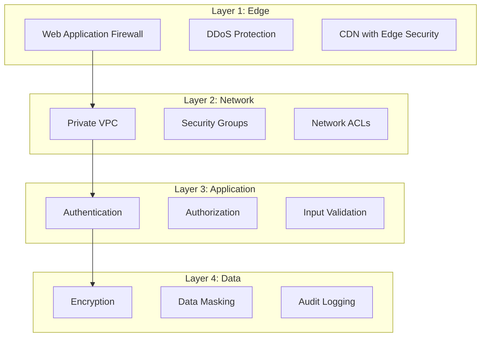
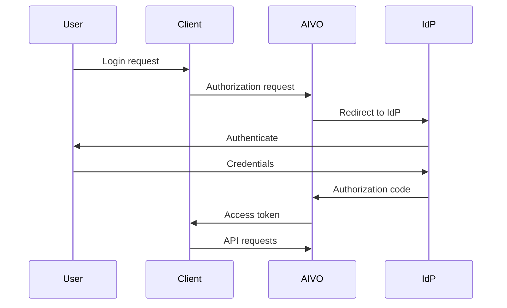

# Security Overview

Security is foundational to the AIVO Platform. We implement multiple layers of protection to safeguard student data and ensure compliance with educational privacy regulations.

## Security Principles

### 1. Defense in Depth

Multiple security layers protect your data:



### 2. Zero Trust

We verify every request:

- No implicit trust based on network location
- Continuous authentication and authorization
- Least privilege access by default

### 3. Data Minimization

We collect only what's necessary:

- Purpose-limited data collection
- Automatic data expiration
- Easy data deletion (right to erasure)

## Authentication

### API Key Authentication

For server-to-server communication:

```bash
curl -H "X-API-Key: sk_live_abc123..." \
  https://api.aivo.edu/v2/lessons
```

**Best Practices:**

- Store keys in environment variables
- Rotate keys regularly (every 90 days)
- Use separate keys for development and production
- Limit key scopes to required permissions

### JWT Authentication

For user sessions:

```bash
curl -H "Authorization: Bearer eyJhbG..." \
  https://api.aivo.edu/v2/users/me
```

**Token Properties:**

- Algorithm: RS256
- Expiration: 15 minutes (access), 7 days (refresh)
- Claims: user ID, roles, tenant ID

### OAuth 2.0 / OpenID Connect

For third-party integrations:



### Multi-Factor Authentication

MFA support for sensitive accounts:

- TOTP (Google Authenticator, Authy)
- SMS verification
- Email verification
- Hardware keys (WebAuthn)

## Authorization

### Role-Based Access Control (RBAC)

| Role        | Permissions                                              |
| ----------- | -------------------------------------------------------- |
| **Student** | View enrolled content, submit answers, view own progress |
| **Teacher** | Create content, view class progress, grade assessments   |
| **Parent**  | View child progress, manage settings, data requests      |
| **Admin**   | Full access to organization resources                    |

### Attribute-Based Access Control (ABAC)

Fine-grained permissions based on:

- Resource ownership
- Time-based access
- Location restrictions
- Grade level appropriateness

### API Scopes

Limit API key permissions:

| Scope            | Access                     |
| ---------------- | -------------------------- |
| `lessons:read`   | Read lessons               |
| `lessons:write`  | Create/update lessons      |
| `users:read`     | Read user profiles         |
| `analytics:read` | Read analytics data        |
| `admin`          | Full administrative access |

```javascript
const aivo = new Aivo({
  apiKey: 'sk_live_...',
  scopes: ['lessons:read', 'users:read'],
});
```

## Encryption

### In Transit

All data encrypted with TLS 1.3:

- Certificate pinning for mobile apps
- HSTS with 1-year max-age
- Perfect forward secrecy

### At Rest

Data encrypted with AES-256:

- Database: Transparent Data Encryption (TDE)
- Files: Server-side encryption (SSE-S3)
- Backups: Encrypted with customer-managed keys

### Field-Level Encryption

Sensitive fields encrypted individually:

- Student PII
- Assessment answers
- Authentication credentials

```sql
-- Encrypted columns
SELECT
  id,
  pgp_sym_decrypt(name, key) as name,
  email_hash,
  grade_level
FROM students;
```

## Data Protection

### PII Handling

Personal Identifiable Information is:

- Encrypted at rest
- Masked in logs
- Excluded from analytics
- Deleted upon request

### Data Residency

Choose data storage location:

- United States
- European Union
- Other regions upon request

### Data Retention

| Data Type              | Retention Period           |
| ---------------------- | -------------------------- |
| User profiles          | Account lifetime + 30 days |
| Learning progress      | Account lifetime + 30 days |
| Analytics (aggregated) | 2 years                    |
| Audit logs             | 7 years                    |
| Session logs           | 90 days                    |

## Security Monitoring

### Intrusion Detection

- Network-based IDS (Suricata)
- Host-based IDS (OSSEC)
- Application-level anomaly detection

### Security Logging

All security events logged:

- Authentication attempts
- Authorization decisions
- Configuration changes
- Data access patterns

```json
{
  "timestamp": "2024-01-15T10:30:00Z",
  "event": "authentication.success",
  "userId": "usr_abc123",
  "ip": "192.168.1.1",
  "userAgent": "Mozilla/5.0...",
  "mfaUsed": true
}
```

### Alerting

Real-time alerts for:

- Brute force attempts
- Unusual access patterns
- Configuration changes
- Data export requests

## Vulnerability Management

### Security Testing

| Type                | Frequency  |
| ------------------- | ---------- |
| Automated scanning  | Daily      |
| Penetration testing | Quarterly  |
| Bug bounty program  | Continuous |
| Code review         | Every PR   |

### Dependency Management

- Automated dependency updates (Dependabot)
- License compliance checking
- Vulnerability scanning (Snyk)

### Responsible Disclosure

Report vulnerabilities to: security@aivo.edu

| Severity | Response Time | Patch Time |
| -------- | ------------- | ---------- |
| Critical | 4 hours       | 24 hours   |
| High     | 24 hours      | 7 days     |
| Medium   | 72 hours      | 30 days    |
| Low      | 1 week        | 90 days    |

## Incident Response

### Response Process

1. **Detection** - Automated monitoring alerts
2. **Triage** - Severity assessment
3. **Containment** - Limit impact
4. **Eradication** - Remove threat
5. **Recovery** - Restore services
6. **Lessons Learned** - Improve processes

### Communication

- Status page: status.aivo.edu
- Security advisories: email notification
- Compliance notifications: Within required timeframes

## Compliance

### Certifications

- SOC 2 Type II
- ISO 27001
- PCI DSS (for payments)

### Regulations

- **COPPA** - Children's Online Privacy Protection Act
- **FERPA** - Family Educational Rights and Privacy Act
- **GDPR** - General Data Protection Regulation
- **CCPA** - California Consumer Privacy Act

See [Compliance Documentation](/docs/compliance) for details.
