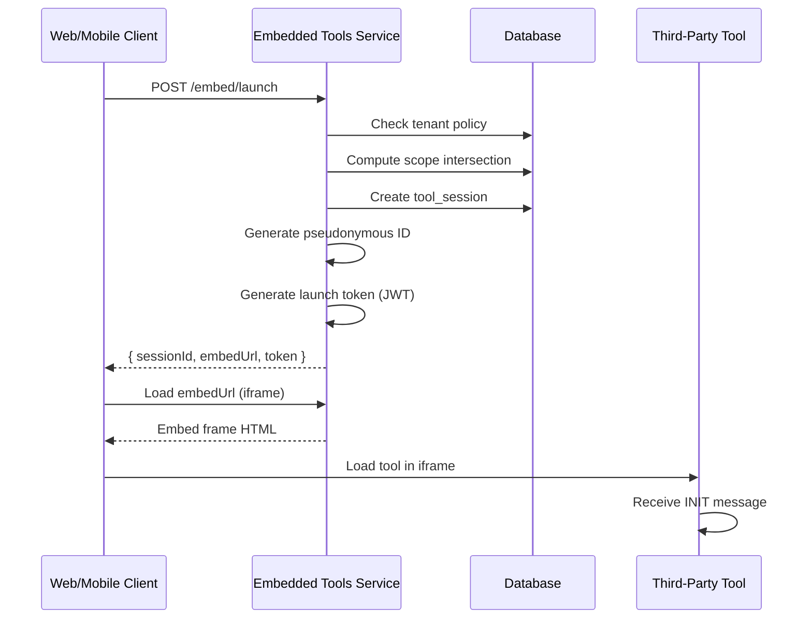

# Embedded Tools Framework

## Overview

The Embedded Tools Framework provides a secure, COPPA/FERPA-compliant way to integrate third-party learning tools into the Aivo platform. It handles:

- **Sandboxed embedding** via iframes (web) and WebViews (mobile)
- **Launch tokens** (JWTs) with scoped permissions
- **Pseudonymous learner IDs** to minimize PII exposure
- **Session tracking** with event capture
- **Tenant-level policy controls** for scope management

## Architecture

```
┌─────────────────────────────────────────────────────────────────────┐
│                          Aivo Platform                              │
├─────────────────────────────────────────────────────────────────────┤
│                                                                     │
│  ┌──────────────┐   ┌──────────────────┐   ┌──────────────────┐   │
│  │  Web Client  │   │  Mobile Learner  │   │  Mobile Parent   │   │
│  │  (Next.js)   │   │    (Flutter)     │   │    (Flutter)     │   │
│  └──────┬───────┘   └────────┬─────────┘   └────────┬─────────┘   │
│         │                    │                      │              │
│         ▼                    ▼                      ▼              │
│  ┌──────────────────────────────────────────────────────────────┐ │
│  │                   Embedded Tools Service                      │ │
│  │  • Session Management    • Launch Token Generation            │ │
│  │  • Event Recording       • Scope Validation                   │ │
│  │  • Embed Frame Serving   • Tenant Policy Management           │ │
│  └──────────────────────────────────────────────────────────────┘ │
│                              │                                     │
│                              ▼                                     │
│  ┌──────────────────────────────────────────────────────────────┐ │
│  │                    Embed Frame (HTML)                         │ │
│  │  • postMessage Bridge    • Token Injection                    │ │
│  │  • Event Forwarding      • Theme Updates                      │ │
│  └──────────────────────────────────────────────────────────────┘ │
│                              │                                     │
└──────────────────────────────┼─────────────────────────────────────┘
                               │
                               ▼
                   ┌───────────────────────┐
                   │   Third-Party Tool    │
                   │   (iframe sandbox)    │
                   └───────────────────────┘
```

## Launch Flow

### 1. Session Creation



### 2. Launch Request

```typescript
// Request
POST /embed/launch
{
  "toolId": "math-blaster-v2",
  "installationId": "uuid-of-installation",
  "learnerId": "uuid-of-learner",
  "tenantId": "uuid-of-tenant",
  "activityId": "fractions-101",
  "themeMode": "light",
  "locale": "en-US"
}

// Response
{
  "sessionId": "uuid-of-session",
  "embedUrl": "https://embed.aivo.io/embed/frame?sessionId=...&token=...",
  "directLaunchUrl": "https://tool.example.com/launch",
  "token": "eyJhbGciOiJIUzI1NiIs...",
  "expiresAt": "2024-12-12T12:30:00Z",
  "grantedScopes": ["LEARNER_PROFILE_MIN", "SESSION_EVENTS_WRITE", "PROGRESS_READ"]
}
```

## Launch Token (JWT)

### Token Structure

```typescript
interface LaunchTokenPayload {
  // Standard JWT claims
  iss: 'aivo-embedded-tools';
  sub: string; // Tool session ID
  iat: number; // Issued at
  exp: number; // Expiry (15 min default)

  // Custom claims
  tenantId: string;
  toolId: string;
  pseudonymousLearnerId: string;
  scopes: ToolScope[];
}
```

### Pseudonymous Learner ID

To protect learner privacy, we generate a pseudonymous ID:

```typescript
pseudonymousLearnerId = SHA256(learnerId + ':' + tenantSecret).substring(0, 16);
```

- **Deterministic**: Same learner always gets the same ID
- **Irreversible**: Cannot recover real learner ID without tenant secret
- **Tenant-scoped**: Different pseudonymous ID across tenants

## Scopes

Scopes control what data tools can access and what actions they can perform.

### Available Scopes

| Scope                   | Description                             | COPPA Safe           |
| ----------------------- | --------------------------------------- | -------------------- |
| `LEARNER_PROFILE_MIN`   | First name initial, grade band, subject | ✅                   |
| `LEARNER_PROFILE_FULL`  | Full name, avatar, grade                | ⚠️ Requires consent  |
| `SESSION_EVENTS_WRITE`  | Submit events to Aivo                   | ✅                   |
| `SESSION_EVENTS_READ`   | Read session event history              | ✅                   |
| `PROGRESS_READ`         | Read learner progress                   | ✅                   |
| `PROGRESS_WRITE`        | Update learner progress                 | ✅                   |
| `GRADE_BAND_READ`       | Read grade band                         | ✅                   |
| `THEME_READ`            | Read UI theme preferences               | ✅                   |
| `CLASSROOM_ROSTER_READ` | Read classroom roster                   | ⚠️ Tenant admin only |
| `ASSIGNMENT_READ`       | Read assignment context                 | ✅                   |
| `BADGE_AWARD`           | Award badges to learner                 | ✅                   |
| `ANALYTICS_WRITE`       | Submit analytics events                 | ✅                   |
| `OFFLINE_ACCESS`        | Enable offline mode                     | ✅                   |

### Scope Intersection

Granted scopes = Tool Required Scopes ∩ Tenant Allowed Scopes

```typescript
// Tool requires these scopes
const toolRequired = ['LEARNER_PROFILE_MIN', 'SESSION_EVENTS_WRITE', 'PROGRESS_READ'];

// Tenant has granted these scopes
const tenantAllowed = ['LEARNER_PROFILE_MIN', 'SESSION_EVENTS_WRITE'];

// Resulting granted scopes
const granted = ['LEARNER_PROFILE_MIN', 'SESSION_EVENTS_WRITE'];
// ⚠️ Launch fails if any required scope is missing
```

## postMessage Protocol

The embed frame and tool communicate via `postMessage`.

### Messages: Aivo → Tool

#### INIT

Sent when the tool iframe loads.

```typescript
{
  type: 'INIT',
  version: '1.0',
  payload: {
    sessionId: 'uuid',
    token: 'jwt-token',
    learnerContext: {
      pseudonymousId: 'abc123...',
      themeMode: 'light',
      locale: 'en-US'
    },
    scopes: ['LEARNER_PROFILE_MIN', 'SESSION_EVENTS_WRITE']
  }
}
```

#### THEME_UPDATE

Sent when the parent theme changes.

```typescript
{
  type: 'THEME_UPDATE',
  payload: {
    mode: 'dark',
    primaryColor: '#6366f1',
    fontFamily: 'Inter'
  }
}
```

#### END_SESSION

Sent when the session should end.

```typescript
{
  type: 'END_SESSION',
  payload: {
    reason: 'TIMEOUT' | 'USER_EXIT' | 'NAVIGATION' | 'ADMIN_TERMINATION'
  }
}
```

#### LEARNER_CONTEXT_UPDATE

Sent when learner context changes.

```typescript
{
  type: 'LEARNER_CONTEXT_UPDATE',
  payload: {
    gradeBand: 'K-2',
    subject: 'math'
  }
}
```

### Messages: Tool → Aivo

#### SESSION_EVENT

Report an event to Aivo.

```typescript
{
  type: 'SESSION_EVENT',
  payload: {
    eventType: 'ACTIVITY_COMPLETED',
    eventTimestamp: '2024-12-12T12:00:00Z',
    activityId: 'fractions-101',
    score: 85,
    durationSeconds: 300,
    data: {
      attempts: 3,
      hintsUsed: 1
    }
  }
}
```

#### UI_REQUEST

Request UI changes from the host.

```typescript
{
  type: 'UI_REQUEST',
  payload: {
    action: 'resize' | 'fullscreen' | 'exit',
    dimensions?: { width: 800, height: 600 },
    data?: { ... }
  }
}
```

#### ERROR

Report an error to Aivo.

```typescript
{
  type: 'ERROR',
  payload: {
    errorCode: 'NETWORK_ERROR',
    errorMessage: 'Failed to load resource',
    severity: 'warning' | 'error' | 'critical',
    recoverable: true
  }
}
```

## Session Events

### Event Types

| Type                 | Description                   | Required Fields          |
| -------------------- | ----------------------------- | ------------------------ |
| `ACTIVITY_STARTED`   | Learner started an activity   | activityId               |
| `ACTIVITY_COMPLETED` | Learner completed an activity | activityId, activityName |
| `BADGE_EARNED`       | Learner earned a badge        | badgeId, badgeName       |
| `PROGRESS_UPDATE`    | Progress percentage updated   | progressPercent          |
| `SCORE_RECORDED`     | Score was recorded            | score                    |
| `TIME_SPENT`         | Time spent update             | durationSeconds          |
| `INTERACTION`        | Generic interaction           | data                     |
| `TOOL_ERROR`         | Tool encountered an error     | errorCode, errorMessage  |
| `CUSTOM`             | Custom event                  | data                     |
| `HEARTBEAT`          | Keep-alive signal             | -                        |
| `END_SESSION`        | Session ended                 | reason                   |

### Recording Events via API

```typescript
POST /api/events
Authorization: Bearer <launch-token>
Content-Type: application/json

{
  "sessionId": "uuid-of-session",
  "eventType": "SCORE_RECORDED",
  "eventTimestamp": "2024-12-12T12:00:00Z",
  "activityId": "fractions-quiz",
  "score": 92,
  "data": {
    "questionsCorrect": 23,
    "questionsTotal": 25
  }
}
```

### Batch Events

```typescript
POST /api/events/batch
Authorization: Bearer <launch-token>
Content-Type: application/json

{
  "sessionId": "uuid-of-session",
  "events": [
    { "eventType": "ACTIVITY_STARTED", "eventTimestamp": "...", "activityId": "q1" },
    { "eventType": "INTERACTION", "eventTimestamp": "...", "data": { "answer": "A" } },
    { "eventType": "ACTIVITY_COMPLETED", "eventTimestamp": "...", "activityId": "q1" }
  ]
}
```

## Web Embedding (Next.js)

### React Component

```tsx
// components/ToolEmbed.tsx
'use client';

import { useEffect, useRef, useState } from 'react';

interface ToolEmbedProps {
  sessionId: string;
  embedUrl: string;
  onEvent?: (event: ToolEvent) => void;
  onExit?: (data?: unknown) => void;
  onError?: (error: ToolError) => void;
}

export function ToolEmbed({ sessionId, embedUrl, onEvent, onExit, onError }: ToolEmbedProps) {
  const iframeRef = useRef<HTMLIFrameElement>(null);
  const [isLoading, setIsLoading] = useState(true);

  useEffect(() => {
    const handleMessage = (event: MessageEvent) => {
      const { data } = event;
      if (!data?.type) return;

      switch (data.type) {
        case 'AIVO_TOOL_ERROR':
          if (data.sessionId === sessionId) {
            onError?.(data.error);
          }
          break;

        case 'AIVO_EXIT_REQUEST':
          if (data.sessionId === sessionId) {
            onExit?.(data.data);
          }
          break;

        case 'AIVO_RESIZE_REQUEST':
          if (data.sessionId === sessionId) {
            // Handle resize
          }
          break;
      }
    };

    window.addEventListener('message', handleMessage);
    return () => window.removeEventListener('message', handleMessage);
  }, [sessionId, onEvent, onExit, onError]);

  // Send theme updates
  const updateTheme = (theme: ThemeConfig) => {
    iframeRef.current?.contentWindow?.postMessage({ type: 'AIVO_THEME_UPDATE', theme }, '*');
  };

  return (
    <div className="relative w-full h-full">
      {isLoading && (
        <div className="absolute inset-0 flex items-center justify-center">
          <Spinner />
        </div>
      )}
      <iframe
        ref={iframeRef}
        src={embedUrl}
        className="w-full h-full border-0"
        onLoad={() => setIsLoading(false)}
        sandbox="allow-scripts allow-same-origin allow-forms allow-popups"
        allow="autoplay; microphone; camera"
        title="Learning Tool"
      />
    </div>
  );
}
```

### Usage

```tsx
// pages/activity/[id].tsx
import { ToolEmbed } from '@/components/ToolEmbed';

export default function ActivityPage() {
  const [session, setSession] = useState<ToolSession | null>(null);

  useEffect(() => {
    // Launch tool session
    async function launchTool() {
      const response = await fetch('/api/embed/launch', {
        method: 'POST',
        headers: { 'Content-Type': 'application/json' },
        body: JSON.stringify({
          toolId: 'math-blaster-v2',
          installationId: 'installation-uuid',
          learnerId: user.id,
          tenantId: tenant.id,
          activityId: 'fractions-101',
        }),
      });
      setSession(await response.json());
    }
    launchTool();
  }, []);

  if (!session) return <Loading />;

  return (
    <div className="h-screen">
      <ToolEmbed
        sessionId={session.sessionId}
        embedUrl={session.embedUrl}
        onExit={() => router.push('/activities')}
        onError={(error) => toast.error(error.errorMessage)}
      />
    </div>
  );
}
```

## Mobile Embedding (Flutter)

### WebView Integration

```dart
// lib/widgets/tool_embed.dart
import 'package:flutter/material.dart';
import 'package:webview_flutter/webview_flutter.dart';
import 'dart:convert';

class ToolEmbed extends StatefulWidget {
  final String sessionId;
  final String embedUrl;
  final Function(Map<String, dynamic>)? onEvent;
  final VoidCallback? onExit;
  final Function(Map<String, dynamic>)? onError;

  const ToolEmbed({
    super.key,
    required this.sessionId,
    required this.embedUrl,
    this.onEvent,
    this.onExit,
    this.onError,
  });

  @override
  State<ToolEmbed> createState() => _ToolEmbedState();
}

class _ToolEmbedState extends State<ToolEmbed> {
  late final WebViewController _controller;
  bool _isLoading = true;

  @override
  void initState() {
    super.initState();
    _controller = WebViewController()
      ..setJavaScriptMode(JavaScriptMode.unrestricted)
      ..setBackgroundColor(Colors.white)
      ..setNavigationDelegate(
        NavigationDelegate(
          onPageFinished: (url) {
            setState(() => _isLoading = false);
            _injectBridge();
          },
        ),
      )
      ..addJavaScriptChannel(
        'AivoBridge',
        onMessageReceived: _handleMessage,
      )
      ..loadRequest(Uri.parse(widget.embedUrl));
  }

  void _injectBridge() {
    _controller.runJavaScript('''
      window.aivoNative = {
        postMessage: function(message) {
          AivoBridge.postMessage(JSON.stringify(message));
        }
      };
    ''');
  }

  void _handleMessage(JavaScriptMessage message) {
    try {
      final data = jsonDecode(message.message);
      switch (data['type']) {
        case 'AIVO_TOOL_ERROR':
          widget.onError?.call(data['error']);
          break;
        case 'AIVO_EXIT_REQUEST':
          widget.onExit?.call();
          break;
        case 'SESSION_EVENT':
          widget.onEvent?.call(data['payload']);
          break;
      }
    } catch (e) {
      debugPrint('Failed to parse message: $e');
    }
  }

  void updateTheme(Map<String, dynamic> theme) {
    _controller.runJavaScript('''
      window.postMessage({
        type: 'AIVO_THEME_UPDATE',
        theme: ${jsonEncode(theme)}
      }, '*');
    ''');
  }

  @override
  Widget build(BuildContext context) {
    return Stack(
      children: [
        WebViewWidget(controller: _controller),
        if (_isLoading)
          const Center(child: CircularProgressIndicator()),
      ],
    );
  }
}
```

### Usage

```dart
// lib/screens/activity_screen.dart
import 'package:flutter/material.dart';
import '../widgets/tool_embed.dart';
import '../services/embed_service.dart';

class ActivityScreen extends StatefulWidget {
  final String activityId;

  const ActivityScreen({super.key, required this.activityId});

  @override
  State<ActivityScreen> createState() => _ActivityScreenState();
}

class _ActivityScreenState extends State<ActivityScreen> {
  ToolSession? _session;

  @override
  void initState() {
    super.initState();
    _launchTool();
  }

  Future<void> _launchTool() async {
    final session = await EmbedService.launch(
      toolId: 'math-blaster-v2',
      activityId: widget.activityId,
    );
    setState(() => _session = session);
  }

  @override
  Widget build(BuildContext context) {
    if (_session == null) {
      return const Scaffold(
        body: Center(child: CircularProgressIndicator()),
      );
    }

    return Scaffold(
      body: SafeArea(
        child: ToolEmbed(
          sessionId: _session!.sessionId,
          embedUrl: _session!.embedUrl,
          onExit: () => Navigator.of(context).pop(),
          onError: (error) {
            ScaffoldMessenger.of(context).showSnackBar(
              SnackBar(content: Text(error['errorMessage'] ?? 'Error')),
            );
          },
        ),
      ),
    );
  }
}
```

## Tenant Administration

### Managing Tool Policies

```typescript
// Enable a tool for tenant
PUT /api/admin/tenants/:tenantId/policies/:toolId
{
  "isEnabled": true,
  "maxSessionDurationMinutes": 60,
  "requireParentalConsent": false,
  "allowedGradeBands": ["K-2", "3-5"],
  "allowedSubjects": ["math", "reading"]
}

// Grant scopes
PUT /api/admin/tenants/:tenantId/policies/:toolId/scopes
[
  { "scope": "LEARNER_PROFILE_MIN", "isGranted": true, "grantedBy": "admin-uuid" },
  { "scope": "SESSION_EVENTS_WRITE", "isGranted": true, "grantedBy": "admin-uuid" },
  { "scope": "PROGRESS_READ", "isGranted": true, "grantedBy": "admin-uuid" },
  { "scope": "LEARNER_PROFILE_FULL", "isGranted": false, "grantedBy": "admin-uuid" }
]
```

### Installing Tools

```typescript
// Install a tool
POST /api/admin/tenants/:tenantId/installations
{
  "toolId": "math-blaster-v2",
  "displayName": "Math Blaster",
  "isEnabled": true
}
```

## Security Considerations

### Token Security

- Tokens are short-lived (15 minutes default)
- Use separate signing key (`TOOL_JWT_SECRET`) from main auth
- Tokens are bound to specific session ID
- Validate origin on all postMessage communications

### Data Minimization (COPPA/FERPA)

- Use pseudonymous IDs instead of real learner IDs
- Only pass minimal learner context (grade band, subject)
- Full profile requires explicit scope grant and consent
- No PII in session events payload

### Sandbox Restrictions

```html
<iframe
  sandbox="allow-scripts allow-same-origin allow-forms allow-popups"
  allow="autoplay; microphone; camera"
  ...
/>
```

- `allow-scripts`: Required for interactive tools
- `allow-same-origin`: Required for tool's own APIs
- `allow-forms`: Allow form submissions
- `allow-popups`: Allow OAuth popups (if needed)
- **NOT allowed**: `allow-top-navigation`, `allow-downloads`

### Content Security Policy

```
frame-src: 'self' *;          // Allow embedding any tool
script-src: 'self' 'unsafe-inline';  // Required for embed frame
connect-src: 'self' *;        // Tools may need various APIs
```

## Error Handling

### Common Errors

| Error                        | Cause                              | Resolution                  |
| ---------------------------- | ---------------------------------- | --------------------------- |
| `Missing required scopes`    | Tenant hasn't granted all scopes   | Admin must grant scopes     |
| `Tool installation disabled` | Installation is disabled           | Admin must enable           |
| `Session expired`            | Token TTL exceeded                 | Re-launch session           |
| `Invalid origin`             | postMessage from unexpected origin | Check tool configuration    |
| `Scope violation`            | Tool tried unauthorized action     | Event logged, action denied |

### Monitoring

All scope violations and errors are logged to `session_events` table:

```sql
SELECT * FROM session_events
WHERE event_type IN ('SCOPE_VIOLATION', 'VALIDATION_ERROR', 'TOOL_ERROR')
AND created_at > NOW() - INTERVAL '24 hours';
```

## API Reference

### Embed Service Endpoints

| Method | Path                            | Description             |
| ------ | ------------------------------- | ----------------------- |
| `POST` | `/embed/launch`                 | Launch a tool session   |
| `GET`  | `/embed/frame`                  | Serve embed frame HTML  |
| `GET`  | `/embed/config/:installationId` | Get embed configuration |
| `POST` | `/embed/validate-origin`        | Validate message origin |

### Session Endpoints

| Method  | Path                       | Description           |
| ------- | -------------------------- | --------------------- |
| `POST`  | `/api/sessions`            | Create new session    |
| `GET`   | `/api/sessions/:id`        | Get session details   |
| `GET`   | `/api/sessions/:id/token`  | Get launch token      |
| `PATCH` | `/api/sessions/:id/status` | Update session status |
| `GET`   | `/api/sessions/:id/events` | List session events   |

### Event Endpoints

| Method | Path                     | Description             |
| ------ | ------------------------ | ----------------------- |
| `POST` | `/api/events`            | Record event            |
| `POST` | `/api/events/batch`      | Record batch events     |
| `GET`  | `/api/events/:sessionId` | List events for session |

### Admin Endpoints

| Method | Path                                             | Description         |
| ------ | ------------------------------------------------ | ------------------- |
| `GET`  | `/api/admin/tenants/:id/policies`                | List policies       |
| `PUT`  | `/api/admin/tenants/:id/policies/:toolId`        | Upsert policy       |
| `GET`  | `/api/admin/tenants/:id/policies/:toolId/scopes` | Get scope grants    |
| `PUT`  | `/api/admin/tenants/:id/policies/:toolId/scopes` | Update scope grants |
| `GET`  | `/api/admin/tenants/:id/installations`           | List installations  |
| `POST` | `/api/admin/tenants/:id/installations`           | Create installation |
