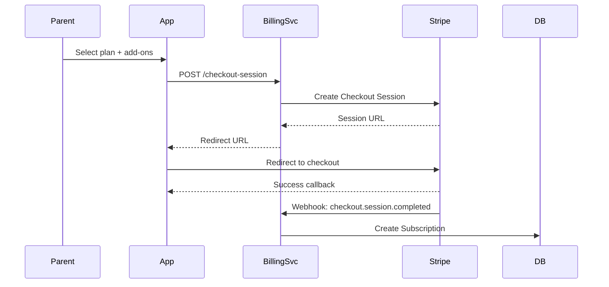

# Billing Service (`billing-svc`)

The Billing Service manages parent/family subscriptions for the Aivo platform. It handles checkout, subscription management, trials, proration, dunning, and analytics.

## Features

- **Per-learner SKU subscriptions** - BASE + optional add-ons (SEL, Speech, Science)
- **30-day free trials** for add-on modules (one-time per family per SKU)
- **Stripe-powered proration** for mid-cycle subscription changes
- **Dunning flow** - payment retry sequences with progressive notifications
- **Limited Mode** - restricts access when payments are overdue
- **Invoice history & PDF downloads** via Stripe
- **Admin coupon management** with Stripe sync
- **Usage & revenue analytics** dashboard

## Architecture

```
┌─────────────────┐     ┌─────────────────┐     ┌─────────────────┐
│   Mobile Apps   │     │    Web Apps     │     │  Admin Portal   │
└────────┬────────┘     └────────┬────────┘     └────────┬────────┘
         │                       │                       │
         └───────────────────────┼───────────────────────┘
                                 │
                    ┌────────────▼────────────┐
                    │      Kong Gateway       │
                    └────────────┬────────────┘
                                 │
         ┌───────────────────────┼───────────────────────┐
         │                       │                       │
┌────────▼────────┐    ┌────────▼────────┐    ┌────────▼────────┐
│  billing-svc    │    │  payments-svc   │    │  session-svc    │
│  (port 4060)    │◄───│  (port 4070)    │    │  (port 4020)    │
└────────┬────────┘    └────────┬────────┘    └────────┬────────┘
         │                       │                       │
         └───────────────────────┼───────────────────────┘
                                 │
                    ┌────────────▼────────────┐
                    │    Stripe Webhooks      │
                    └─────────────────────────┘
```

## SKU Catalog

| SKU | Name | Monthly Price | Description |
|-----|------|---------------|-------------|
| `BASE` | Aivo Base | $14.99 | Core learning platform access |
| `ADDON_SEL` | Social-Emotional Learning | $4.99 | SEL curriculum add-on |
| `ADDON_SPEECH` | Speech & Language | $4.99 | Speech therapy add-on |
| `ADDON_SCIENCE` | Science Content | $4.99 | Extended science curriculum |

## API Endpoints

### Parent Billing Routes

| Method | Path | Description |
|--------|------|-------------|
| `POST` | `/billing/checkout-session` | Create Stripe checkout session |
| `GET` | `/billing/subscription` | Get current subscription |
| `POST` | `/billing/update-modules` | Add/remove modules (proration) |
| `GET` | `/billing/proration-preview` | Preview proration for changes |
| `GET` | `/billing/invoices` | List invoice history |
| `GET` | `/billing/invoices/:id/pdf` | Get invoice PDF URL |
| `POST` | `/billing/cancel` | Cancel subscription |
| `GET` | `/billing/trials/eligibility` | Check trial eligibility |

### Admin Routes

| Method | Path | Description |
|--------|------|-------------|
| `GET` | `/admin/billing/coupons` | List all coupons |
| `POST` | `/admin/billing/coupons` | Create new coupon |
| `PATCH` | `/admin/billing/coupons/:id` | Update coupon |
| `DELETE` | `/admin/billing/coupons/:id` | Deactivate coupon |
| `GET` | `/admin/billing/analytics/snapshot` | Latest analytics |
| `GET` | `/admin/billing/analytics/range` | Analytics for date range |
| `GET` | `/admin/billing/analytics/mrr-trend` | MRR trend data |
| `GET` | `/admin/billing/analytics/addon-adoption` | Add-on adoption rates |

### Internal Routes (Service-to-Service)

| Method | Path | Description |
|--------|------|-------------|
| `GET` | `/internal/billing/access/:tenantId` | Get subscription access info |
| `GET` | `/internal/billing/limited-mode/:tenantId` | Check limited mode status |

## Database Schema

Key tables added by this feature:

```sql
-- Trial tracking
trial_records (
  id, tenant_id, user_id, sku, started_at, ends_at, converted_at
)

-- Coupon management
coupons (
  id, code, name, discount_type, discount_amount, max_redemptions,
  valid_from, valid_until, stripe_coupon_id, active
)

-- Coupon usage
coupon_redemptions (
  id, coupon_id, tenant_id, user_id, subscription_id, redeemed_at
)

-- Dunning records
dunning_records (
  id, subscription_id, payment_intent_id, attempt_number, status,
  amount_cents, failed_at, next_retry_at
)

-- Analytics aggregates
subscription_analytics_daily (
  analytics_date, active_subscriptions, mrr_cents, churned_subscriptions, ...
)
```

## Flows

### Checkout Flow



### Dunning Flow

```
Day 0: Payment fails
  └── Record failure, send "Payment failed" notification

Day 3: Retry #1
  ├── Success → Clear dunning record
  └── Fail → Send "Action required" notification

Day 7: Final retry
  ├── Success → Clear dunning record
  └── Fail → Activate Limited Mode
           └── Send "Account restricted" notification
```

### Limited Mode

When a subscription enters Limited Mode:

1. Session creation returns `402 SUBSCRIPTION_PAST_DUE`
2. UI shows a payment update banner
3. Historical data remains accessible (read-only)
4. New learning sessions are blocked

## Environment Variables

```bash
# Database
DATABASE_URL=postgresql://...

# Stripe
STRIPE_SECRET_KEY=sk_...
STRIPE_WEBHOOK_SECRET=whsec_...

# Service URLs
BILLING_SERVICE_URL=http://billing-svc:4060
NOTIFY_SERVICE_URL=http://notify-svc:4050

# Feature flags
BILLING_CHECK_DISABLED=false  # Disable billing checks in dev
```

## Development

```bash
# Run locally
pnpm --filter @aivo/billing-svc dev

# Run tests
pnpm --filter @aivo/billing-svc test

# Run migrations
pnpm --filter @aivo/billing-svc db:migrate
```

## Testing

Key test scenarios:

1. **Checkout**
   - Create session with BASE only
   - Create session with BASE + add-ons
   - Apply coupon code at checkout

2. **Trials**
   - First-time trial eligibility (should pass)
   - Repeat trial attempt (should fail)
   - Trial expiration handling

3. **Proration**
   - Add add-on mid-cycle (prorated charge)
   - Remove add-on mid-cycle (prorated credit)
   - Preview matches actual charge

4. **Dunning**
   - Payment failure creates dunning record
   - Retry schedule is followed
   - Limited mode activates after final failure
   - Payment success clears dunning

5. **Access Control**
   - Active subscription can start sessions
   - Limited mode blocks new sessions
   - Add-on required for SEL sessions

## Dependencies

- `@aivo/billing-common` - Shared types and SKU config
- `@aivo/billing-access` - Access control helpers for other services
- `stripe` - Stripe SDK
- `@prisma/client` - Database ORM
- `fastify` - HTTP framework
